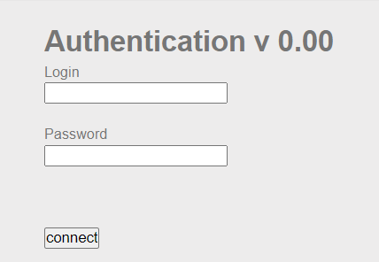
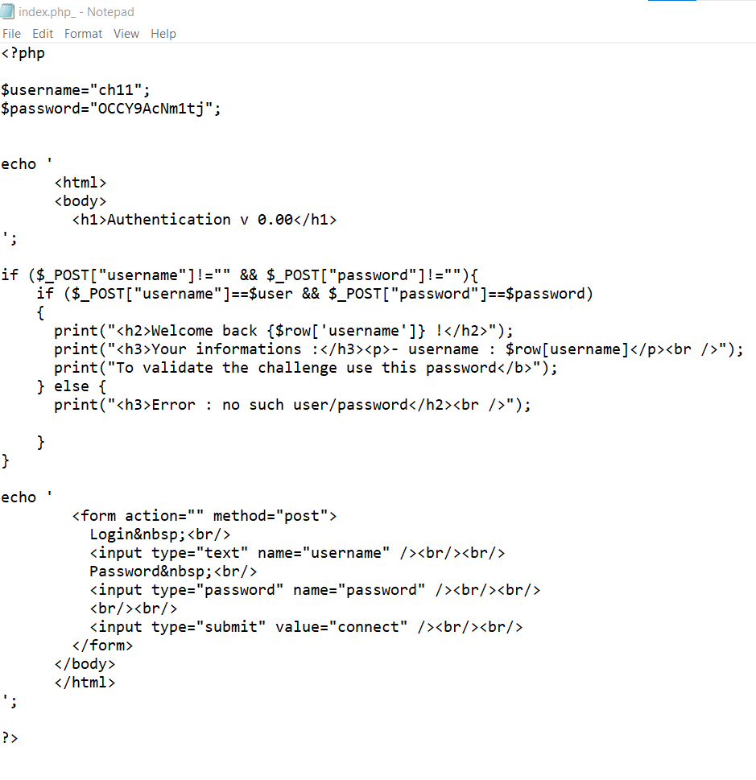

khởi động chall cho mình 1 form login, test sql injection thấy không khả quan lắm
chall này mình dựa vào title, backup file. 
Google search thấy có một số đuôi backup như`~|.bak|.old|.tmp|.save|.orig`

mình thử payload `index.php~` thì nó down về source code

`soong1002`