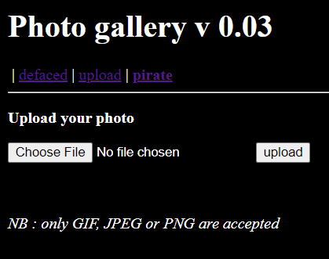
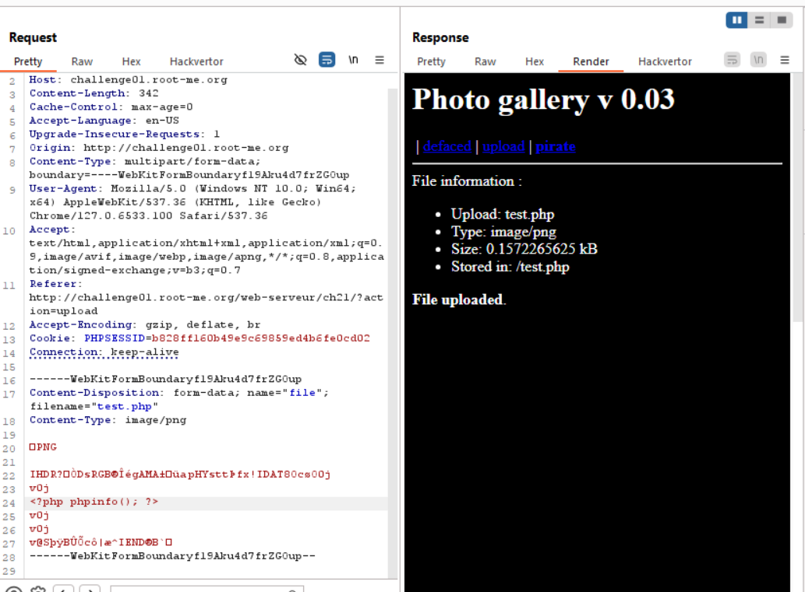
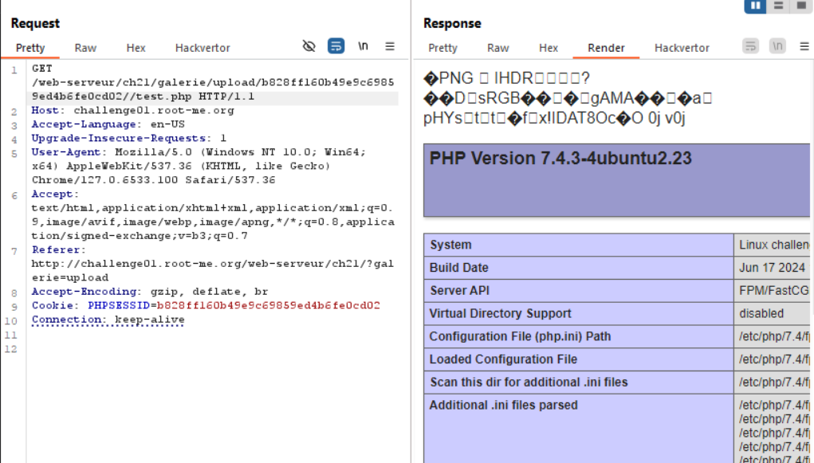

form khá quen thuộc, mình tiến hành exploit luôn nhé

mime type là các byte đầu tiên của 1 file giúp xác định xem nó thuộc loại file gì, chính vì vậy mình chỉ cần chèn thêm ở đầu các byte đặc trưng của từng loại file như GIF, JPEG hay PNG rồi đổi extension filename là bypass

bước lấy flag các bạn tự làm nhé, load phpinfo() là rce được rồi đó

`soong1002`