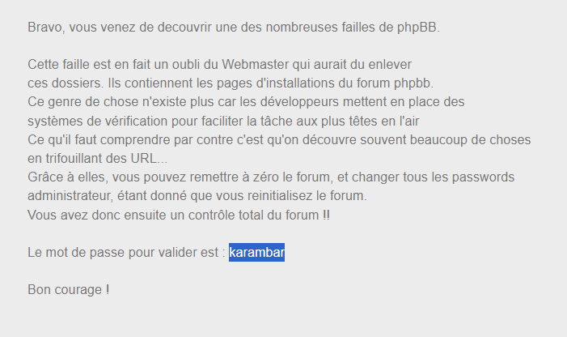

phpBB là gói phần mềm dùng để xây dựng các diễn đàn, phpBB viết bằng ngôn ngữ lập trình PHP có sử dụng cơ sở dữ liệu như MySQL...
truy cập chall

chả có gì :)), what
view source có hint /ch6/phpbb, truy cập vào thôi

lại chẳng có gì, tới đây mình tính scan directory, research về phpBB tại [đây](https://www.phpbb.com/community/viewtopic.php?t=2540856)

oke, mình tim được direct là /install

và 

`soong1002`