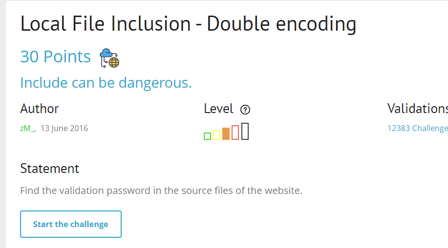
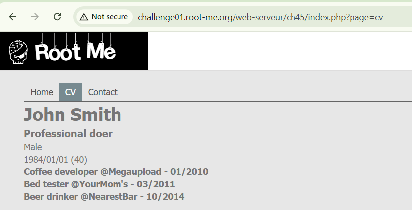
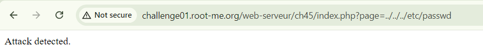
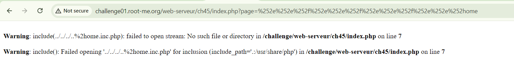
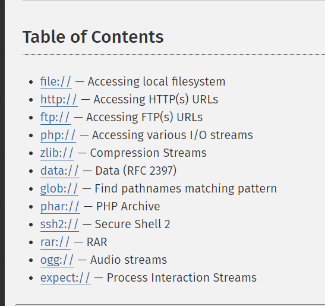
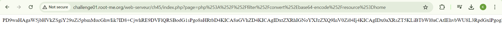
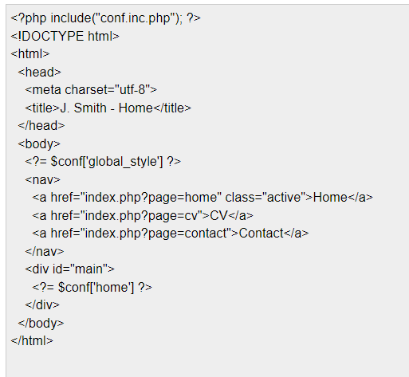
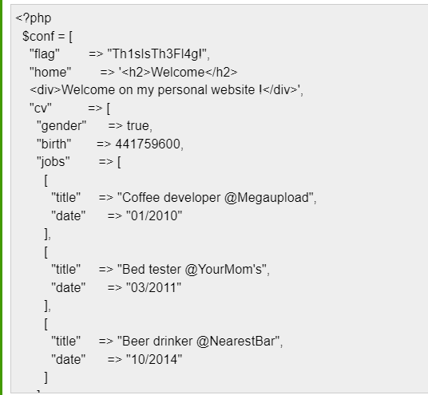

start chall lên nào

mình focus vào các giá trị param
payload phổ thông cho tấn công về file

có thê thấy bypass được filter ../
thêm nữa nó dùng hàm `include()` rất nguy hiểm nếu hacker kiểm soát được input đầu vào mà không filter hoặc filter chưa đủ mạnh

mình thấy nó tự động thêm vào đuôi .inc.php. Đuôi inc

search content về LFI mình biết thêm về PHP Wrappers 

oke, tiến hành exploit nào

payload:
`php://filter/convert.base64-encode/resource=home`
nhớ double encode url

decode nó ra thôi

có vẻ nó include thêm thằng `conf.inc.php`, thay đổi payload để đọc conf.inc.php

done `soong1002`

