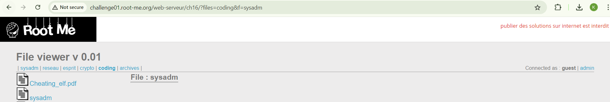
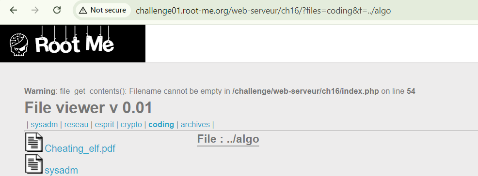
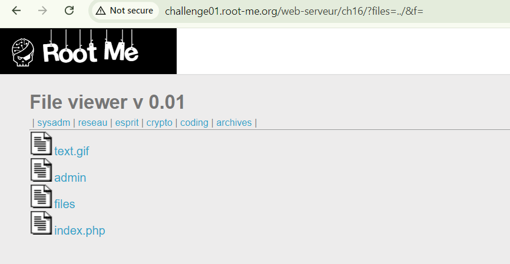
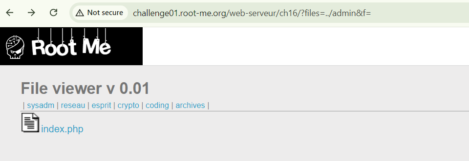

start chall lên

goal: Get in the admin section
click vào admin sẽ bắt login

ae nên tìm hiểu trước về LFI hoặc path traversal vuln nhé
ở đây mình sẽ tiến hành exploit luôn

ae để ý url với parameter trong ảnh trên, mình có thế lợi dụng ../ để thoát ra khỏi thư mục làm việc hiện tại để về thư mục cha
Ở đây mình thay ../ cho `coding` vì thay cho parameter `f` nó báo lỗi như này

câu từ khá khó để giải thích cho ae hiểu tại sao phải thay ../ vào coding mà không phải para f, đại loại ae hình dung para f không cho phép để trống là được, vì khi dùng ../ nó sẽ back ra 1 level từ folder hiện tại

vào admin thôi

có file index.php, mở ra đọc là lấy được password admin!
[image](../image/17.5.png)

`soong1002`
NOTE: ../

