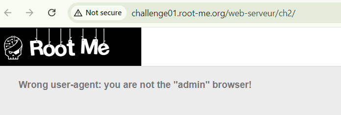
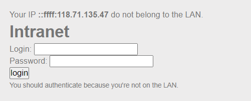

## HTML - Source code

chall này khá dễ, chỉ cần để ý source là được rồi Ctrl + U 


## HTTP - User-agent


nhìn vào des mình focus vào User-agent thui


inject `admin` vào user-agent


giải thích thêm về user-agent cho ae nào chưa biết thì nó là 1 header nằm trong body req nhằm cho server biết thông tin về ứng dụng, hệ điều hành, loại thiết bị và phiên bản trình duyệt đang được sử dụng req tới server, tuy lỗi nằm ở đây đã ít nhiều được fix nhưng không hẳn là không có nhé

## HTTP - Directory indexing


des bảo gì thì làm nấy thoy :v ctrl U

```

<html>
<body><link rel='stylesheet' property='stylesheet' id='s' type='text/css' href='/template/s.css' media='all' /><iframe id='iframe' src='https://www.root-me.org/?page=externe_header'></iframe>
<!-- include("admin/pass.html") -->

</body>
</html>

```
vào endpoint /admin/pass.html


dịch cái mess kia ra cay thật =)), nhưng mình kìm được con quái vật trong lòng 

nhìn lại tên chall mình bỏ thử pass.html đi xem sao


Note: lỗi directory indexing do cấu hình lỗi, khi lỗi này tồn tại, máy chủ sẽ hiển thị danh sách tất cả các tệp tin và thư mục trong một thư mục nhất định thay vì hiển thị một trang mặc định như index.html hoặc index.php. Tóm lại không nên bật nếu không cần thiết

## HTTP - Open redirect


start chall lên nàoo


khi nhấn vào nó sẽ redirect tới các trang được click


ta thấy có para url và para h được thêm vào khi click

mình sẽ thử inject bất kì ở para url


nó báo về sai hash, có lẽ cái para h là mã hash của 1 cái gì đó mà mình chưa biết

quay trở lại para twitter ban đầu, mình thử hash md5 nó xem sao


trùng với cái para h rồi nhé :v 
thử lại với `google.com`


## HTTP - Headers

start chall lên


xem bằng burp coi sao nào


chỗ bôi đen kìa ae:v
inject vào req nhé


## HTTP - POST

start chall lênn


maybe phải vượt qua 999999 thì nó mới nhả flag, mình lại tên chall mình có ý tưởng ròi :v , chặn bắt burp suite 


 có thể thấy, nếu `score` không được Sanitize 
 inject 1 tỉ vào xem =))
 
 

tiền mà cũng thế này thì mê :((

## HTTP - Improper redirect


start chall lênn


 phải login à ?, để ý thấy para `redirect` khá hỏi chấm khi mà chưa login đã show :))) 
 
 

có lẽ nó bắt phải login, ơ thế nếu mình méo redirect thì sao, nghĩa là mình xóa luôn cái para `redirect` đi và vào thẳng index.php. mình đoán là nó vẫn acp nhưng lại redirec về `login.php?rediect=` thôi, nhưng ít ra sẽ nhả lỗi 302 đó :v 

flag ở dưới nhé, ae kéo xuống

## HTTP - Verb tampering


start chall lên


nó bắt phải login, mình thì chưa có account thì login kiểu gì =)), hack thôi :v 


ở dòng 4 khá khả nghi, giá trị `YTph` là gì ? nó có bị sanitize không ?

mình đã thử req lại mấy lần, các giá trị đó đều thay đổi sau mỗi lần(dạng base64 giá trị mình nhập vào)


bài này mình cũng chưa hiểu root cause của nó tại sao thay đổi method lại bypass được ??? mình chỉ test method khác thôi là ra kết quả rồi

## HTTP - Cookies


start chall 


bắt bằng burp mới xem được 


ae để ý chỗ mình bôi đen. thử GET nó xem


để ý bên resp chỗ mình bôi đen, mình exp như sau


một lỗi cơ bản về cookie

## HTTP - IP restriction bypass


đọc cái des mình nghĩ tới SSRF rồi đấy



nó đọc được ip của mình req luôn mà, bắt burp xem sao

nhưng trước đó mình phải search xem ip LAN thế nào đã


tiến hành exploit


ae tự tìm hiểu thêm về `X-Forwarded-For` nhóoo :v 

xong mấy cái HTTP ở rootme roàii, 10 chall này mình vừa ngồi vừa làm vừa viết wu trong vòng 2 tiếng buổi sáng, tự nhiên dở hơi dậy sớm ngồi chill chill =))) , nên có thiếu sót gì ae thông cảm nha 
`soong1002`


