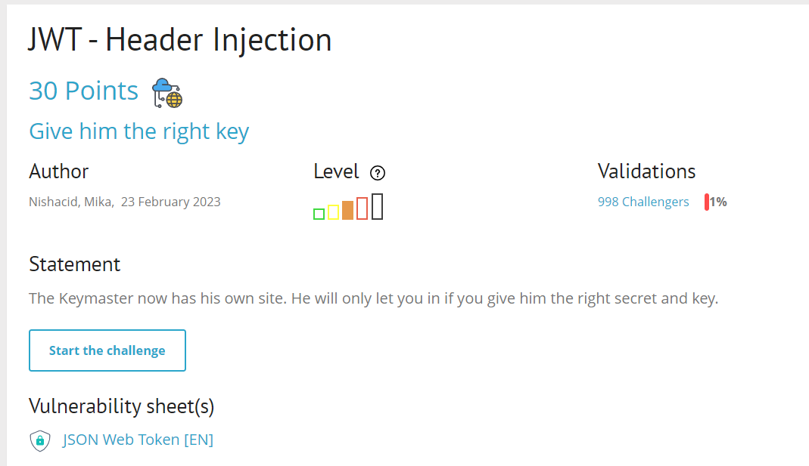
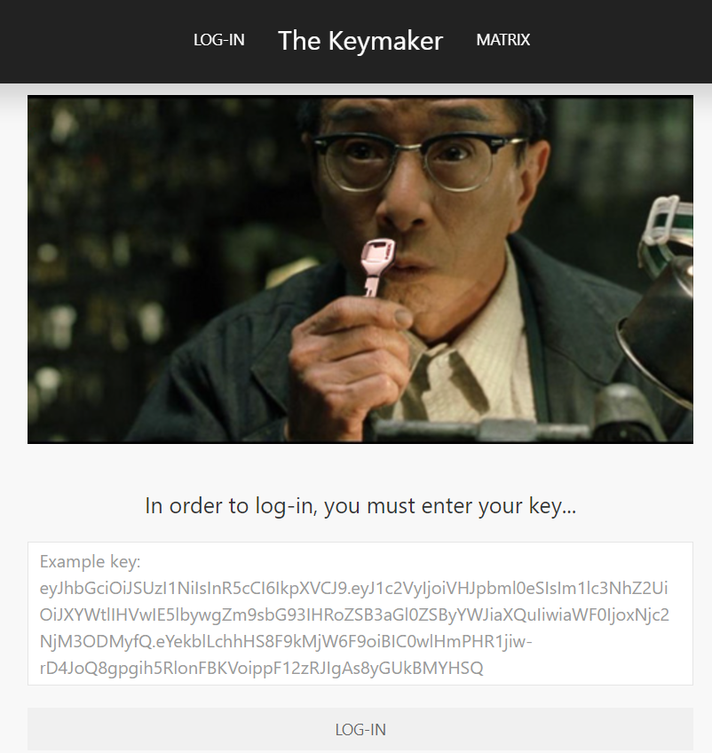
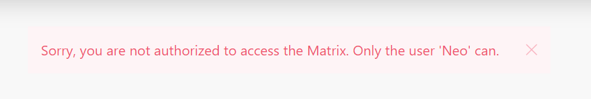
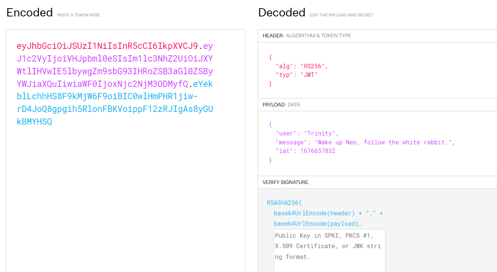
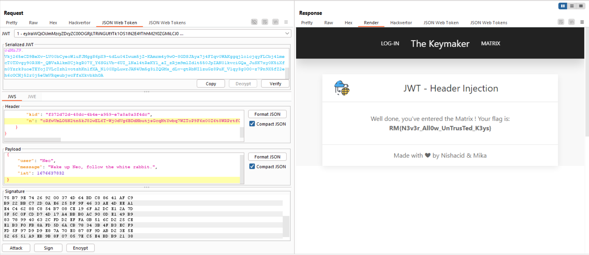

start chall lên nào



chúng ta phải cho nó key đúng thì mới đc vô =)), mình sẽ thử dùng cái placeholder kia xem sao


oce, chỉ có user Neo mới có thể authen, mình chưa biết secret_key là gì nên sẽ thử set alg to None rồi sửa user thành Neo

mình thử rồi, không được nhé ae, nó báo invalid token


bài này dùng thuật toán RSA256 là thuật toán bất đối xứng

mình google search biết được trong header của jwt ngoài 1 số tham số hay gặp như alg, typ thì còn một số tham số sau:
1. `kid`: mình đã nói ở bài JWT - Unsecure File Signature
2. `jwk` (JSON Web Key): Cung cấp một đối tượng JSON được đại diện cho khóa.
3. `jku` (JSON Web Key Set URL): Cung cấp một URL mà từ đó các server có thể tìm nạp một bộ khóa chứa khóa chính xác

câu hỏi mình đặt ra ở chall này là nếu server công nhận một jwk hay jku thì sao, mình hoàn toàn có thể fake ?

ví dụ về `jwk`

```
"jwk": {
        "kty": "RSA",
        "e": "AQAB",
        "kid": "f372d72d-48dc-4b4e-a959-e7a8a8a3f4dc",
        "n": "oRfwVmLO5N2tn5kJ82wEL6T..."
    }
```

Nó đại diện cho `public key` của RSA, kid này cũng định nghĩa như trên, `n`, `e` là tham số liên quan về RSA (liên quan đến việc tính toán của thuật toán này).
Tham số `jkw` trong bài có thể kiểm soát từ người dùng mà server lại không xấc thực nó => bị tấn công. Ý tưởng ở đây là tạo `private key` sau đó nhúng `jwk` đó vào header.
Đầu tiên mình sẽ tạo `RSA key `bằng extension `JWT Editor Keys` của Burp Suite: chọn `New RSA Key -> Generate` (không cần quan tâm giá trị bit vì nó sẽ được điều chỉnh lại).

Tiếp theo dùng extension `JSON Web Token` để nhúng nó vào:
`Attack -> Embedded JWK` -> chon khóa rồi `Ok`.



`soong1002`
