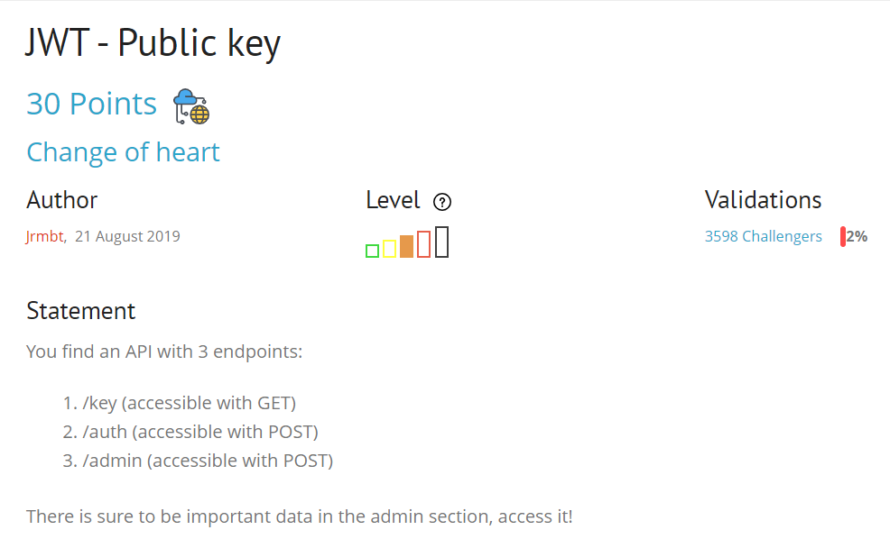
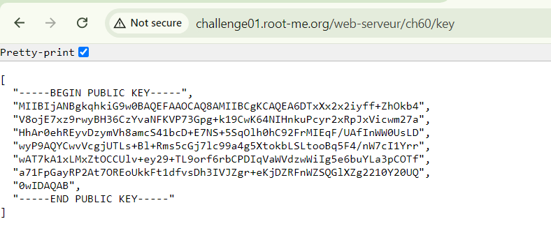
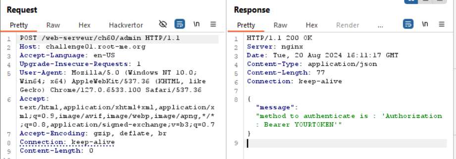
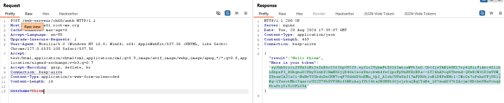
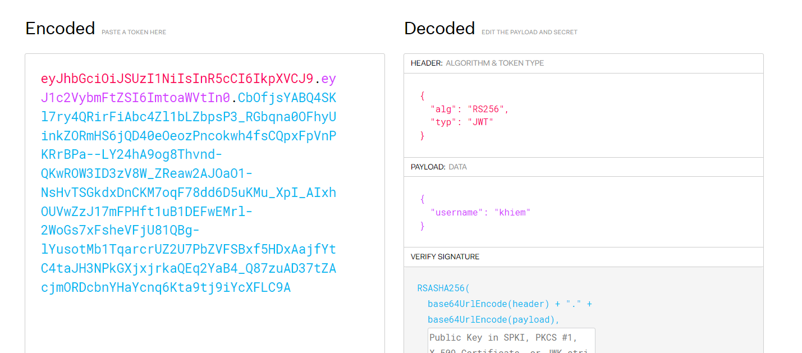
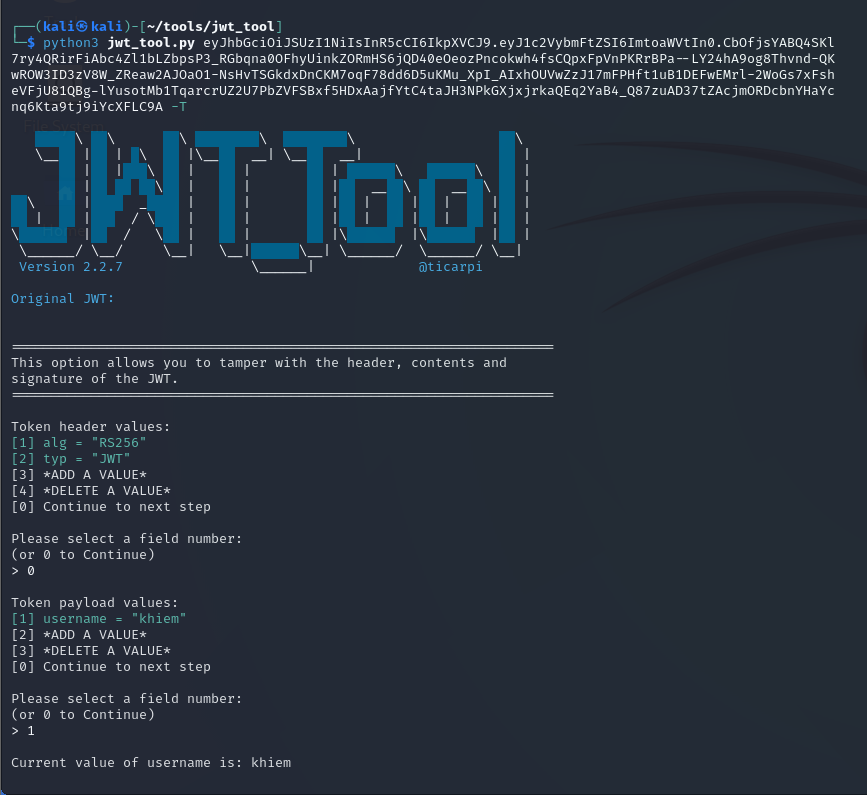
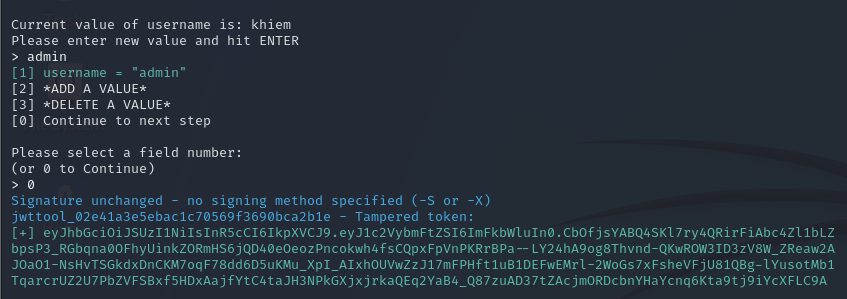
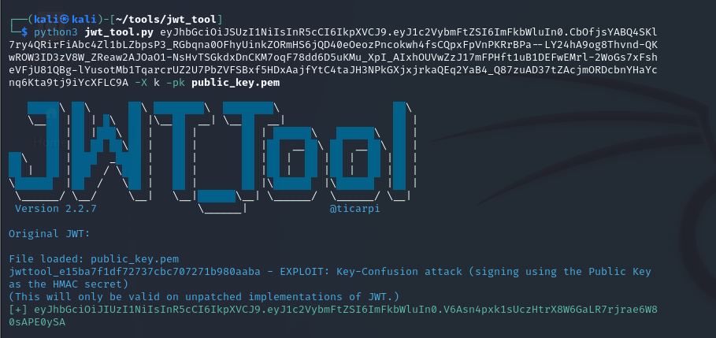
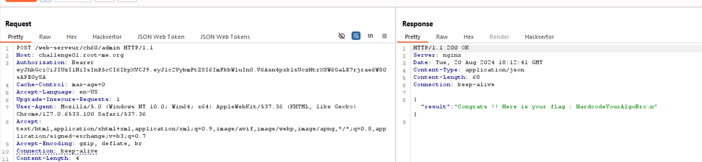

start chall lên nào, vô endpoint /key xem sao
nó nhả ra 1 list public key

giờ hãy thử vào endpoint /auth và /admin với method POST
nó yêu cầu thêm header với giá trị JWT token

google search mình biết rằng nó là mã hóa bất đối xứng, nghĩa là cần private key để mã hóa, còn public key để giải mã 

câu hỏi mình đặt ra: liệu có thể lừa nó mã và giải mã bằng public key không =)), nghe có vẻ không khả thi lắm, nhưng vẫn nên pentest để xem thế nào, biết đâu =))) 

đúng như dự đoán, nó sử dụng thuật toán RS256 là thuật toán bất đối xứng sử dụng 2 khóa để kí và authen

mình đã exploit bằng extension JWT editor trog burp suite ở 1 bài wu khác, mình để link ở [đây](https://github.com/soong1002/portswigger/blob/main/JWT/jwt_confusion_alg.md)

ở bài viết này mình sẽ dùng tool jwt_tool, ae gõ google là ra, down và chạy như mình nhé

nhiều bước thế kia để chỉnh thằng username thành admin đó mà, vì nếu vào endpoint /auth rồi thêm username:admin nó sẽ méo tạo cho mình token đâu, chịu khó tí nhé ae :v

bài này viết thì gọn nhưng chỗ sử dụng thằng tool rách việc lắm, mình ngồi mò 2 tiếng để chơi cái tool này, cayyy vc

`soong1002`

