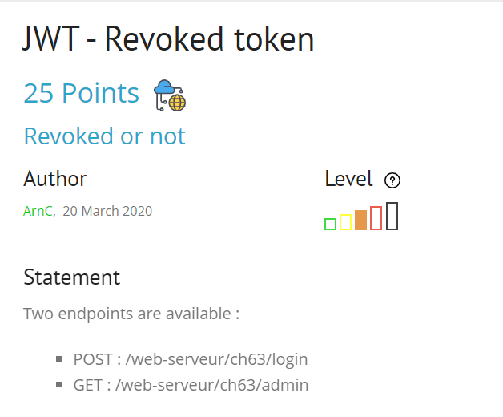
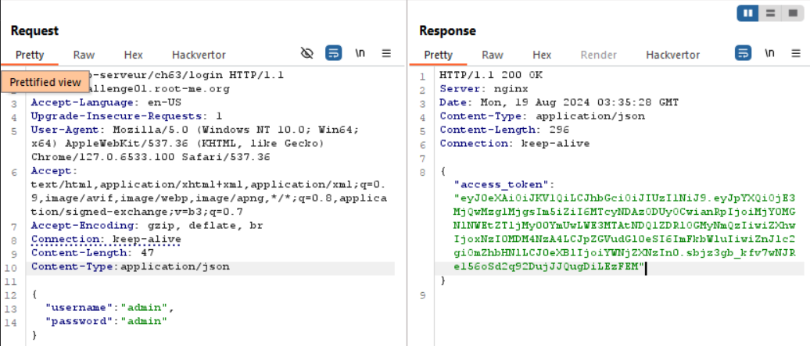
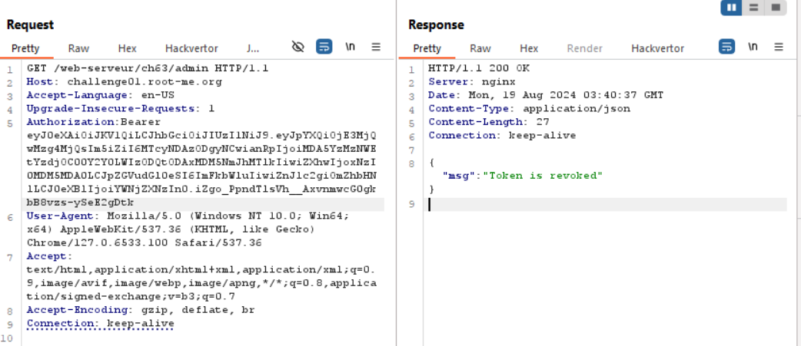
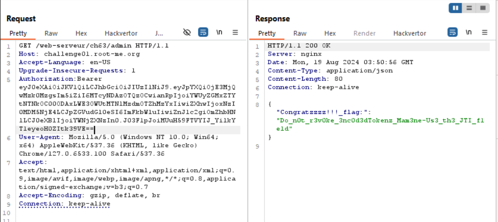
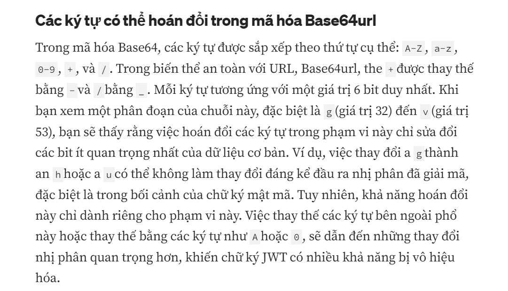

bài này cung cấp source code ở dưới, ae có thể đọc để hiểu nó hoạt động thế nào

nó sẽ nhả flag ra nếu mình vào enpoint admin với access_token không trong blacklist
```
# Standard admin endpoint
@app.route('/web-serveur/ch63/admin', methods=['GET'])
@jwt_required
def protected():
    access_token = request.headers.get("Authorization").split()[1]
    with lock:
        if access_token in blacklist:
            return jsonify({"msg":"Token is revoked"})
        else:
            return jsonify({'Congratzzzz!!!_flag:': FLAG})
```

đồng thời nó cũng cho ta tài khoản của admin luôn
```
# Standard login endpoint
@app.route('/web-serveur/ch63/login', methods=['POST'])
def login():
    try:
        username = request.json.get('username', None)
        password = request.json.get('password', None)
    except:
        return jsonify({"msg":"""Bad request. Submit your login / pass as {"username":"admin","password":"admin"}"""}), 400
 
    if username != 'admin' or password != 'admin':
        return jsonify({"msg": "Bad username or password"}), 401
 
    access_token = create_access_token(identity=username,expires_delta=datetime.timedelta(minutes=3))
    ret = {
        'access_token': access_token,
    }
   
    with lock:
        blacklist.add(access_token)
 
    return jsonify(ret), 200
```
tiến hành đăng nhập với method POST, nhớ thêm Content-Type: application/json nhé ae

nó tạo cho ta một access_token dạng jwt

giờ thử vào endpoint /admin nào


đểu thật, báo token is revoked mới cay =)), lí do vì sao thì source code có rồi ae nên đọc hiểu source code nhé

căng nhỉ, mình cứ tạo ra jwt là nó sẽ add vào blacklist thì sao bypass được, google và chatgpt mất một hồi khá lâu

mình thấy mình gà vl =)), chỉ đơn giản là padding thêm `==` vào cuối là được, vì khi decode nó sẽ bỏ qua phần padding



tuy nhiên còn một cách bypass khác mà mình research được trong quá trình làm, đó là thay đổi `_` trong jwt sang `/`.

ae có thể tham khảo

`soong1002`


