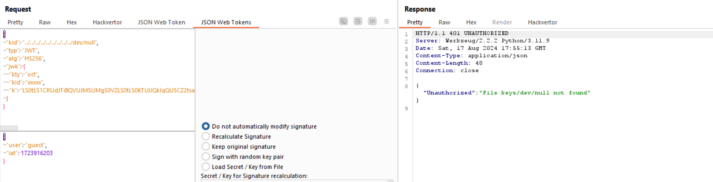

nhấn vào góc phải trên cùng, dùng burpsuite bắt nhé ae

mình thấy cookie dạng JWT ,thử decode nó xem sao 

thử thay giá trị user thành `admin` 

tất nhiên là false rồi, vì jwt còn có secret_key để sign 

dựa vào gợi ý của đề bài mình sẽ research về `kid` trong jwt header

ae có thể hiểu kid giúp định danh xem khóa nào được sử dụng trong quá trình sign và decrypt nếu có nhiều secret_key

trong nhiều trường hợp nó có thể không phải là 1 giá trị cụ thể mà là đường dẫn đến 1 file bất kì để server lấy nội dung file đó làm key để sign

khi mình thử payload `kid: xxxx` thì nhận được return như trên

vấn đề đặt ra là mình không hề biết path dẫn tới secre_key là gì, nhưng minh lại có thể kiểm soát được input path. Vậy sẽ ra sao nếu mình sign nó với 1 path tới file mà mình biết nội dung của file đó ?

tìm hiểu thêm, mình chắc chắn rằng trong server sẽ có path tới /dev/null chứa giá trị rỗng, ta có thể lợi dụng cái này để sign và bypass

có vẻ như ../ đã bị filter, tận dụng một số kĩ thuật bypass mình thử dùng `....//....//....//....//....//....//....//dev/null`

set lại cookie lấy flag

