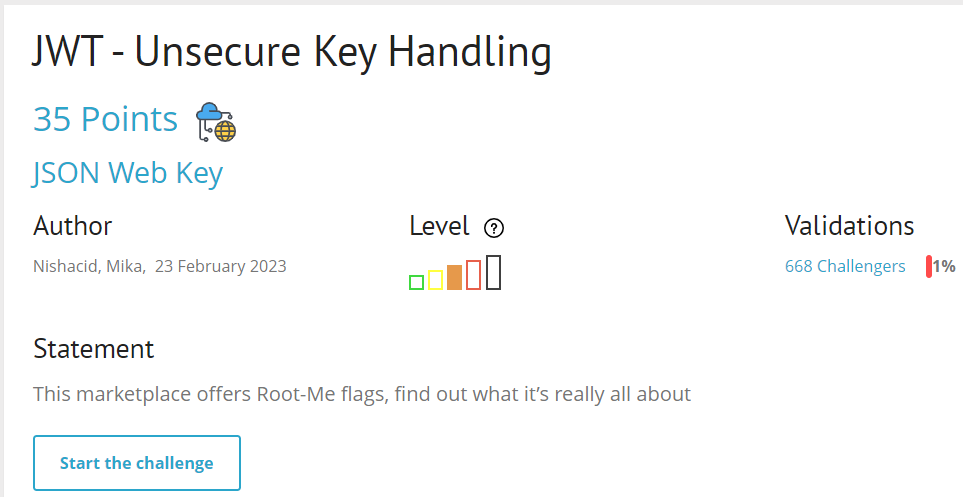
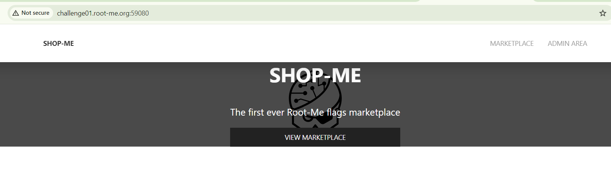
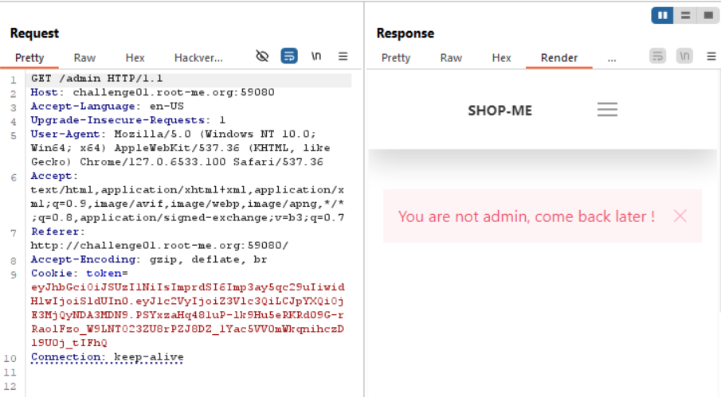
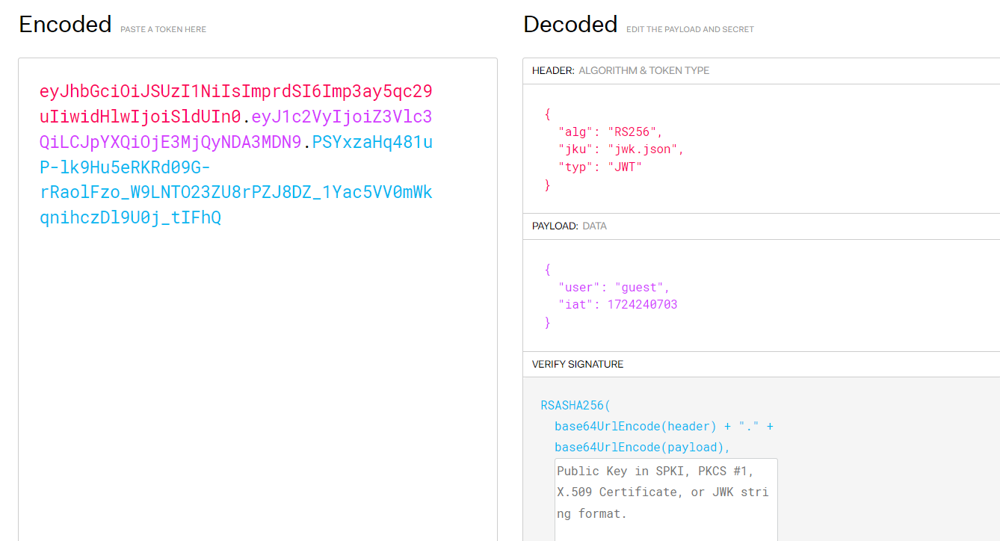
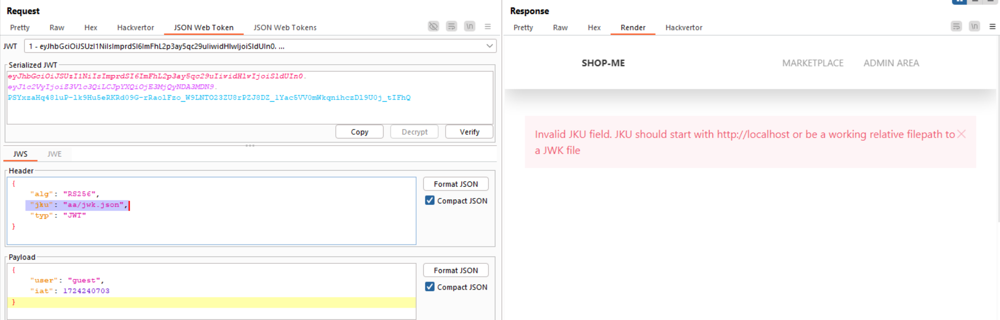

start chall lên nàoo

 có một số feature trong đây, mình dùng thử thì chúng ta phải vào được admin area nhé :v (endpoint /admin)
 

thấy trong req có cookie dạng jwt, thử decode nó với jwt.io xem nào

thuật toán RSA56 bất đối xứng , trong header thấy có `jku`: Nó được sử dụng để chỉ định một URL (đường dẫn) đến một tệp JSON chứa một tập hợp các khóa công khai (JSON Web Key Set - JWKS). Các khóa này được sử dụng để xác thực chữ ký số của JWT.

mình tập trung focus vào thằng `jku` này, mình thử inject vào thì báo lỗi sau

oh, có lẽ nó yêu cầu cần inject bắt đầu bằng `http://localhost`, và giờ mình cần tạo 1 domain bắt đầu bằng `localhost` ví dụ là `localhostkhiem.infinityfreeapp.com` rồi upload 1 file jwk.json với jwk được tạo từ extension jwt editor trong burp suite, sau đó điền ở jku link tới file jwk.json trên đó

note: mình chưa exploit được vì hướng làm trên mới là dự tính, mình chưa tìm được nơi cho phép tạo domain bắt đầu là localhost free :v , chứ bỏ tiền ra mua thì cũng sót =)))

ae chịu khó mày mò thêm để lấy flag nhé

`soong1002`

 