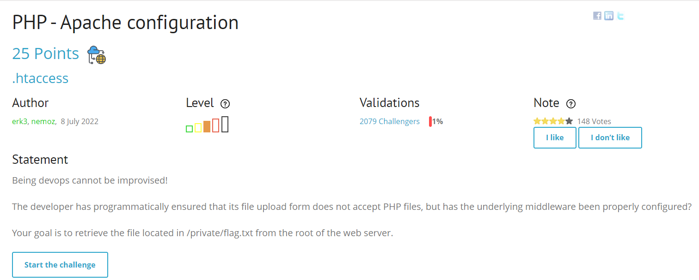
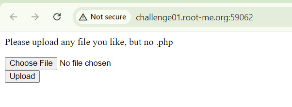
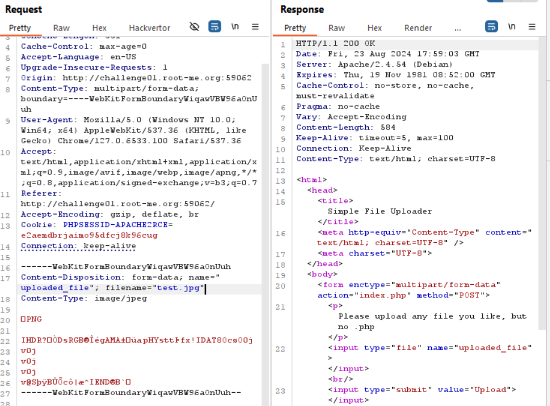
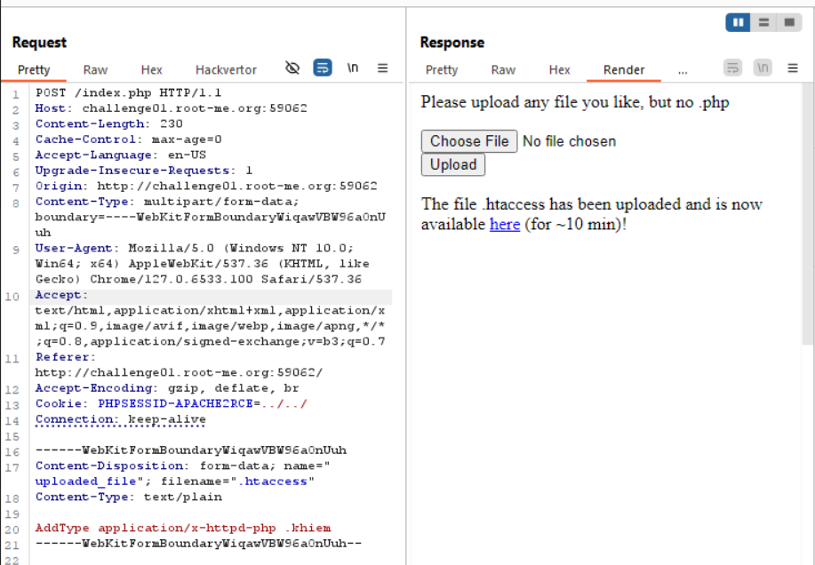
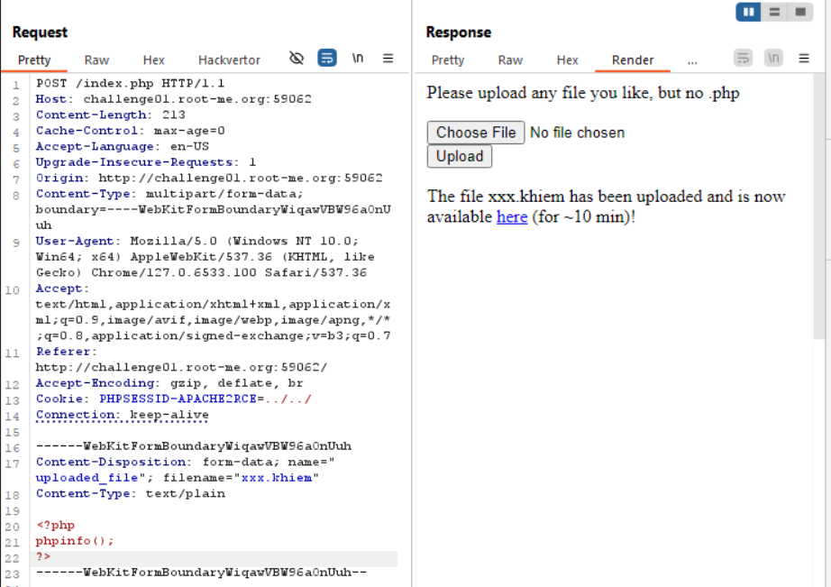
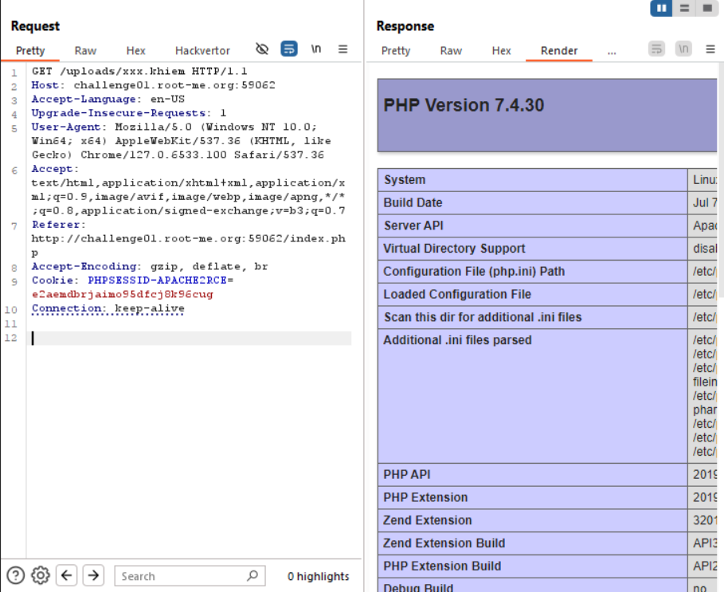

1 bài về `.htaccess`, ae đọc về .htaccess trước khi đọc bài này vì mình sẽ không giải thích lại
goal: đọc file `/private/flag.txt`

nó không cho upload file .php hay gì :v càng cấm càng làm kaka

để ý cái cookie, đó là đường dẫn path tới file mà mình upload lên, mình lợi dụng cái này có thể dính lỗi path traversal. 
tiến hành exploit

upload .htaccess với extension .khiem sẽ được xử lí như .php

payload file `xxx.khiem` 

và đây là kết quả

mấy bài này mình làm qua rồi, giờ ngồi viết lại wu lên không lấy flag nữa, ae chịu khó tự ngồi viết code php lấy flag ở private/flag.txt nhé. Tks ae

`soong1002`

