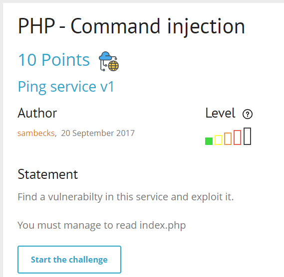
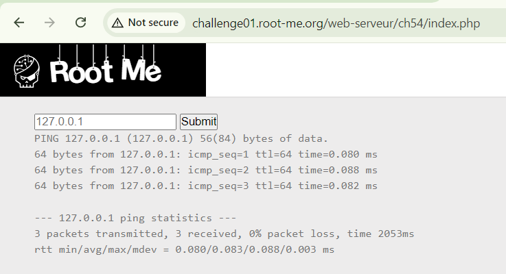
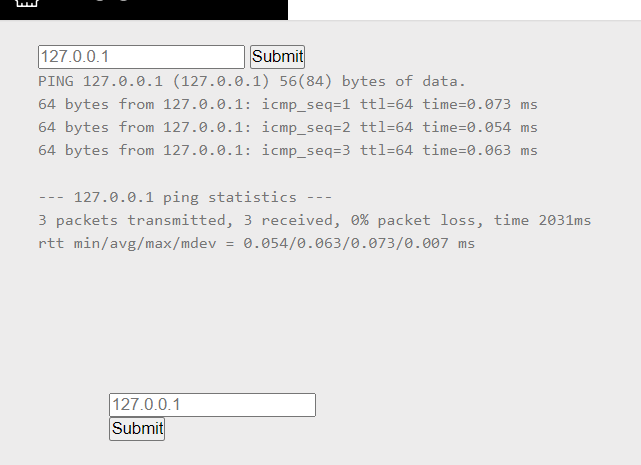
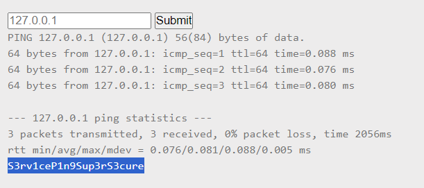

1 chall được rate mức dễ
goal đọc file index.php

start chall lên nàoo

nó có feature ping tới 1 ip bất kì nếu ip đó ping được, từ tiêu đề Command injection mình đoán nó đang sử dụng hàm `system` trong php để exec code

nếu đầu vào không được sanitize, hacker có thể inject thêm lệnh đằng sau để khiến system hay các hàm tương đương exec code

mình truyền payload `127.0.0.1;cat index.php` và

không thấy flag, mình ctrl+U xem thì thấy flag nằm ở `passwd`

payload `127.0.0.1;cat .passwd`

`soong1002`