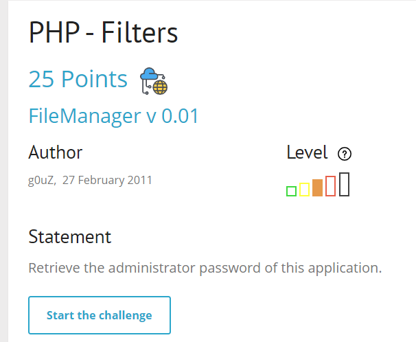
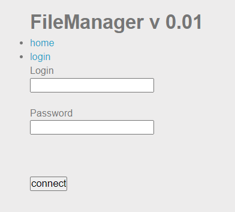
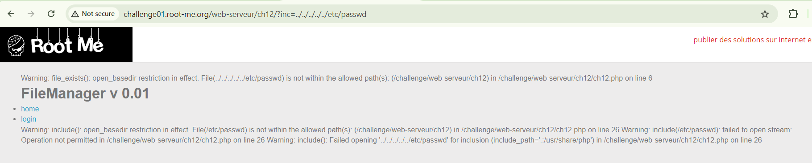
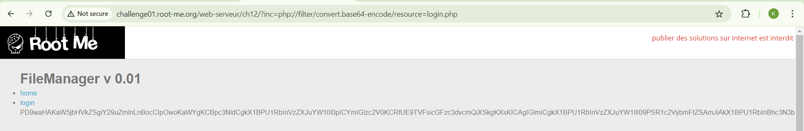
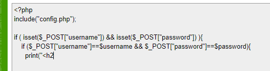
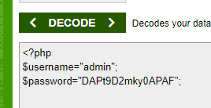

một bài về filter, có lẽ nhiều thứ phải bypass
start chall lên trước đã

phải login mới xem được file, để ý ở url có para `inc` để include file, mình thử inject `../`

nó đang sử dụng `open_basedir` để giới hạn mình truy cập vào các file ngoài thư mục nó cho phép

mình suy nghĩ tới wrappers vì nó có thằng `php://filter`, thử truyền payload này vô xem
`php://filter/convert.base64-encode/resource=login.php`

decode base64 thôi

nó lại include tiếp `config.php`, mình đọc tiếp config.php

và đây là password admin

`soong1002`
