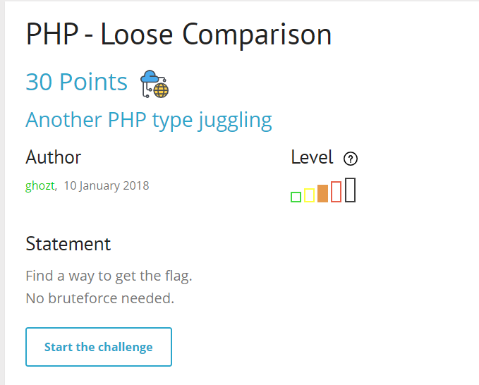
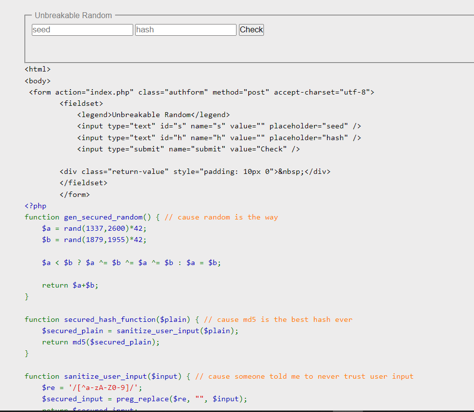
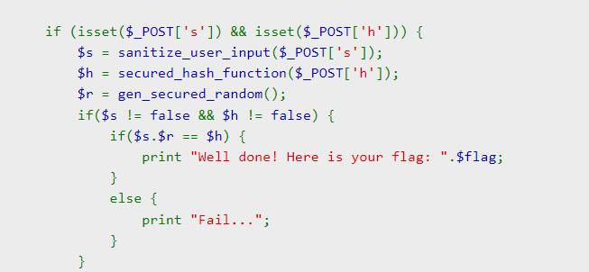
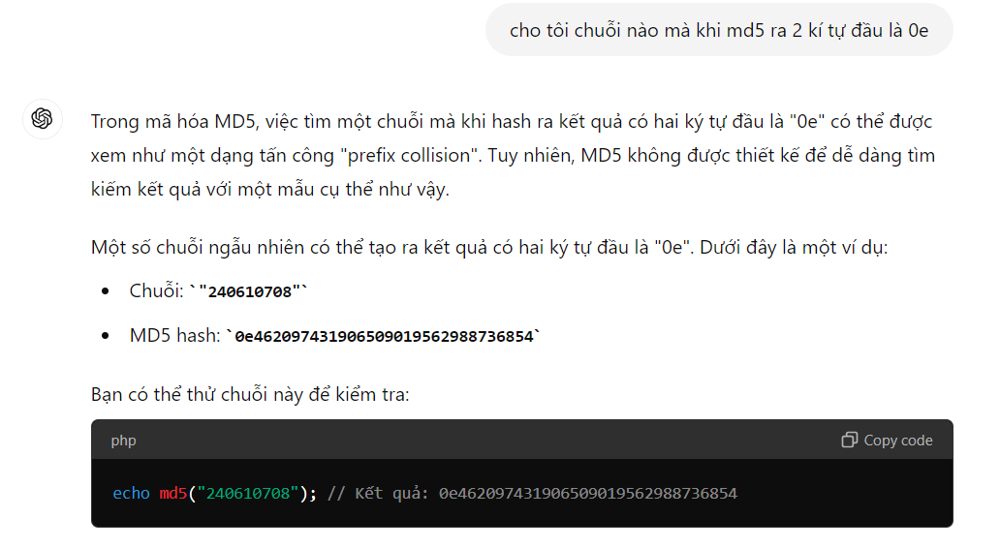
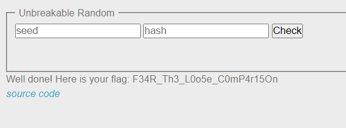

tiêu đề: so sánh lỏng lẻo

start chall lên


chall cung cấp source code cho mình luôn, focus vào phần return flag xem luồng xử lí thế nào 



so sánh khá khó chịu, if $s.$r == $h thì mới nhả flag, trong đó $s là kết quả của việc sanitize_user_input(), còn $r là kết quả của gen_secured_random(), $h là hash md5 của user_input

việc cần làm là tìm đâu ra thằng $s và $r để nó bằng $h đây?

đọc tài liệu của rootme cung cấp cho thấy, nếu mình kiểm soát được mã hash bắt đầu bằng `0e...` thì nó tương đương với giá trị `0`, khi đó đầu vào `$s.$r` sẽ là `0e`,còn $h mình sẽ kiếm chuỗi nào khi md5 ra 2 kí tự đầu tiên cũng là `0e`, khi đó comparison thật sự sẽ là `0`=`0` => bypass

Okey, mình sẽ thử hướng exploit là $h=md5(0), sau đó cố gắng control $s.$r về dạng `0e....`


GPT quả thật rất khỏe =)))

exploit nhé


NOTE: một số chuỗi thỏa mãn bonus cho ae:
```
QNKCDZO
s878926199a
s155964671a
```
`soong1002`


