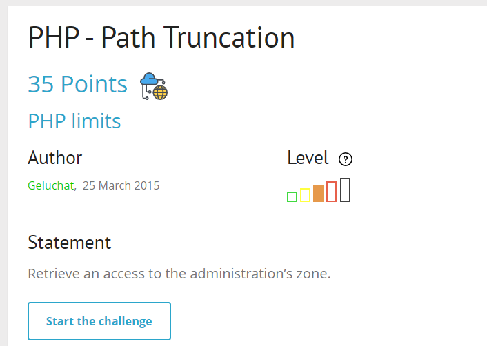
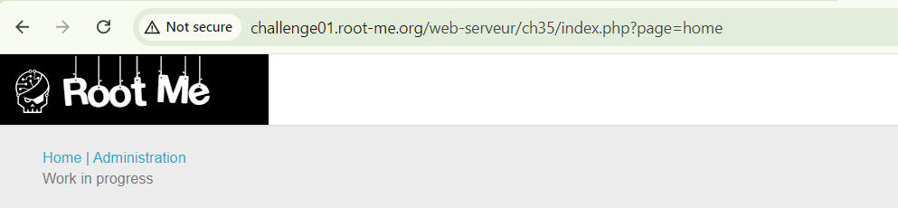
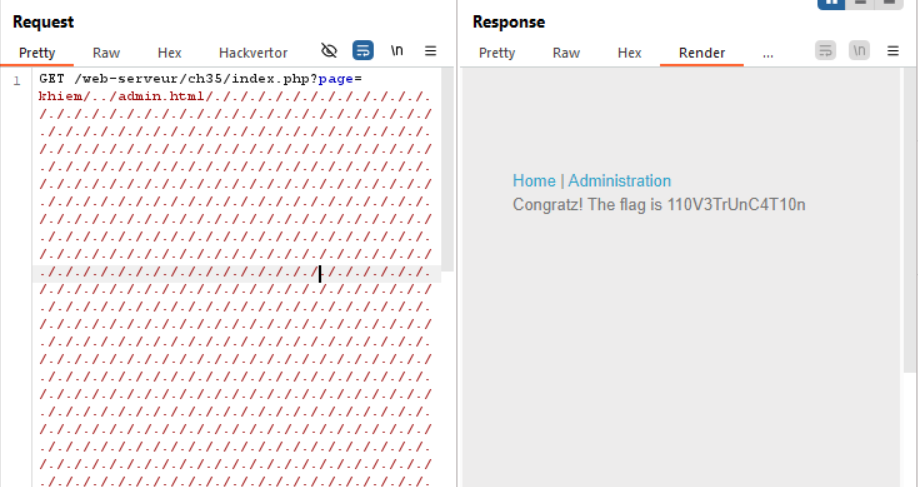

## PHP - Path Truncation


start chall lên nào


đập vào mắt mình đoán sẽ liên quan đến path traversal hay gì đó về path =)), tên chall cũng đã gợi ý rồi mà

mình có tìm được 2 ví dụ sau đây:
ví dụ 1:
```
$ cat /etc//passwd | head -n1
root:x:0:0:root:/root:/bin/bash
```

ví dụ 2:
```
$ cat /etc/./passwd | head -n1
root:x:0:0:root:/root:/bin/bash
```
như đã thấy, dấu chấm trong linux đại diện cho thư mục, file hiện tại, do đó khi sử dụng ./ sẽ không ảnh hưởng đến nội dung trả về, tương đương với `/etc/passwd = /etc/././passwd`

mục tiêu của chall này là đọc được file `admin.html`, và mình đã test rồi, chúng ta chỉ có thể inject payload ở para `page` để đọc file trả về.

Vấn đề bây giờ là ta chưa biết inject bao nhiêu kí tự để nó exec truncation, vì mình suy đoán nếu chưa đạt đến độ dài MAX_LENGTH thì Path mình truyền vào nó sẽ tự động được inject thêm gì đó đằng sau dẫn đến việc file admin.html không trả về được kết quả


sau một hồi search google mình biết được MAX_LENGTH của một đường dẫn là 4096 characters, nên khi chuỗi truyền vào ngoài 4096 characters sẽ bị truncation đi phần inject đằng sau

và đây là flag:


giải thích cho việc mình cần truyền vào một folder không tồn tại `khiem`, ae đọc tài liệu [này](https://repository.root-me.org/Exploitation%20-%20Web/EN%20-%20PHP%20path%20truncation.html?_gl=1*1h0kh9z*_ga*NTQ0MzMwNzM3LjE3MTg1MjA4MDc.*_ga_SRYSKX09J7*MTcyNDkyMTc4My43Ni4xLjE3MjQ5MjIxODIuMC4wLjA.) Mục VI

flag: 110V3TrUnC4T10n
`soong1002`