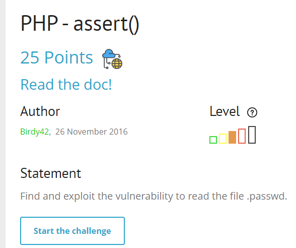
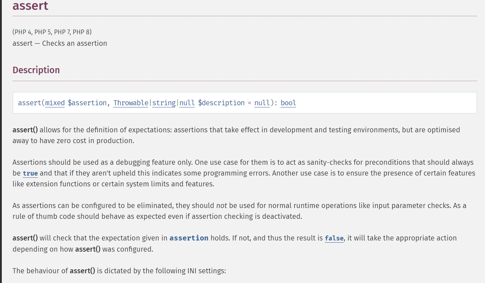
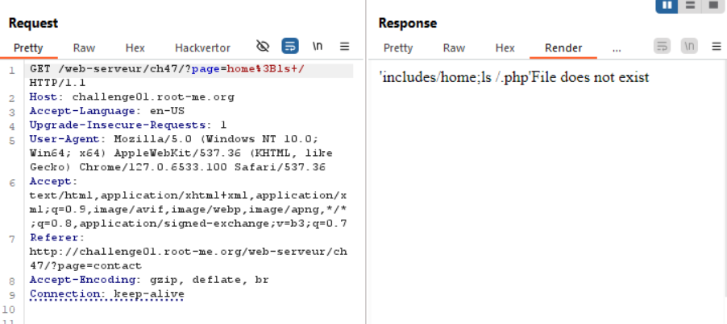
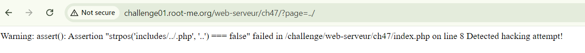
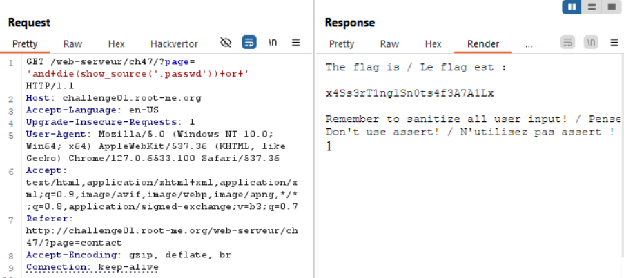

nó bảo đi đọc doc, mình đi đọc doc thôi =))) 

Hàm assert() trong PHP được sử dụng để kiểm tra một biểu thức điều kiện, và nếu biểu thức đó không đúng (false), nó sẽ kích hoạt một lỗi (error). Hàm này thường được dùng trong quá trình phát triển để kiểm tra các điều kiện giả định (assertions) mà lập trình viên cho là đúng.

ok giờ mình thử inject ;ls+/ xem sao

nó chỉ nhả ra 1 path tới `home`, rồi tự động thêm extension `.php` vào, nhưng mình có thấy cái gì liên quan đến assert() đâu ?? :))). 
Sau một hồi test payload mình nhận ra

khi mình truyền vào para `page` value `../`

đến đây phải đọc doc thêm về strpos, hàm strpos() tìm vị trí xuất hiện đầu tiên của chuỗi con trong chuỗi mẹ, tìm thấy thì trả về vị trí của chuỗi con, còn không thì trả về false

Ở đây nếu strpos trả về false thì false === false sẽ return về true, khi đó `Assertion` sẽ là true

tóm lại, nó sẽ ban nếu mình nhập vào có chứa `..`, còn không nếu mình nhập `home` nó sẽ `include(home.php)`

hiểu luồng hoạt động rồi, exploit thôi
mình sẽ tiến hành inject `'and die(show_source('.passwd')) or '`
câu assert sau đó sẽ như sau:
`assertion"strpos('includes/'and die(show_source('.passwd')) or '.php','..')===false"`

`soong1002`