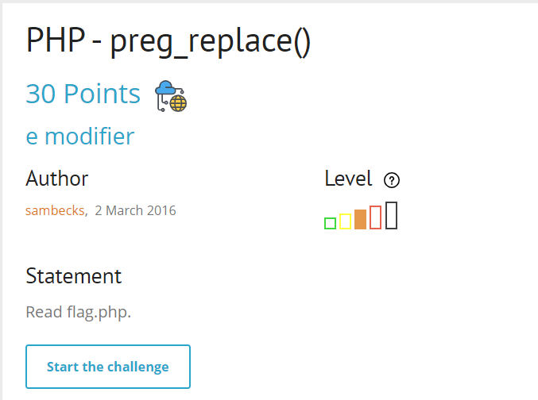
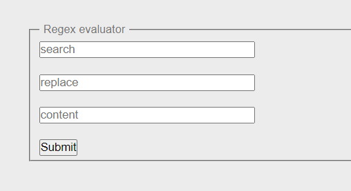
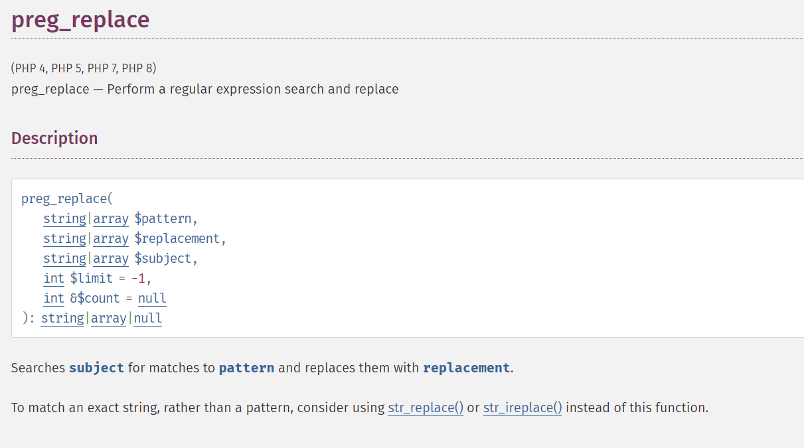
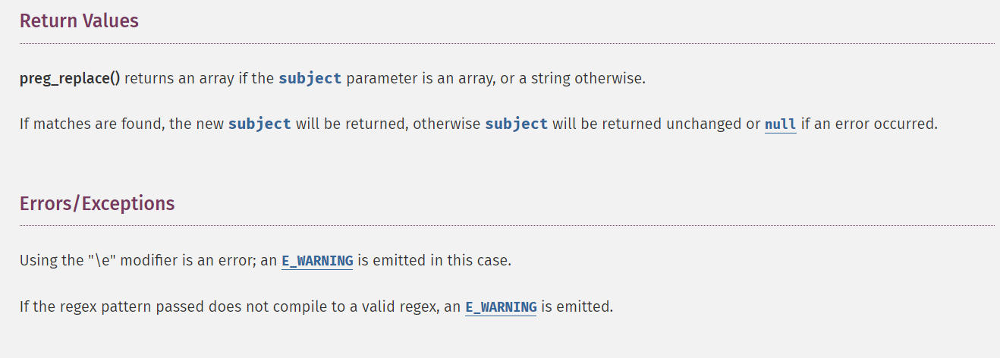
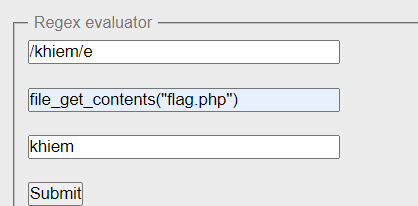
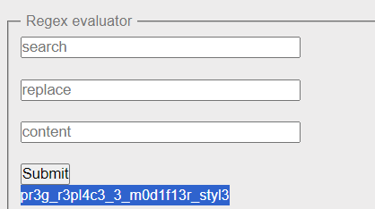

## PHP - preg_replace()

start chall lên nào

tiếp tục google cho preg_replace() thôi

preg_replace nhận vào 3 tham số
1. pattern dùng làm biểu thức chính quy cho subject check
2. replacement sẽ thay thế chuỗi mà subject match trong pattern
3. subject để tìm xem trong pattern có chứa chuỗi mà value subject đang có hay không

có thêm hint về `/e modifier` , nếu sử dụng \e thì nó sẽ execute php

tiến hành exploit

`soong1002`