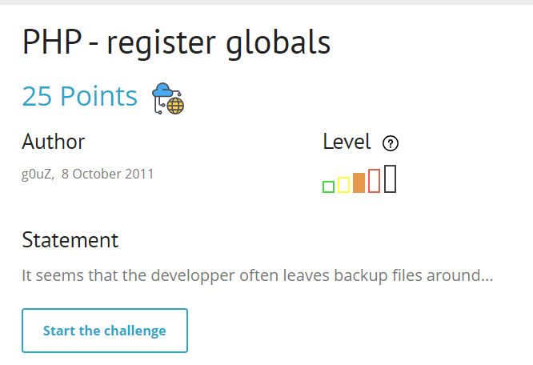
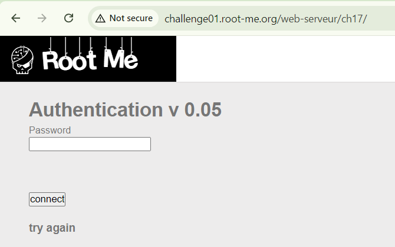
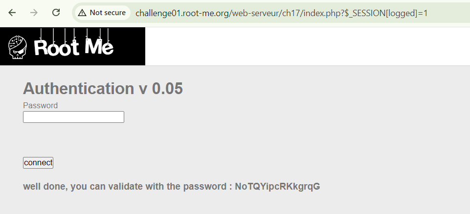

phần desc: có lẽ dev quên file backup đâu đây, start chall lên đã rồi tìm đâu thì tìm


cho mỗi feature input password, có lẽ phải tìm thêm attack surface

dựa vào tiêu đề mình inject `index.php.bak` thì down được source code file index.php về

```
<?php


function auth($password, $hidden_password){
    $res=0;
    if (isset($password) && $password!=""){
        if ( $password == $hidden_password ){
            $res=1;
        }
    }
    $_SESSION["logged"]=$res;
    return $res;
}


function display($res){
    $aff= '
	  <html>
	  <head>
	  </head>
	  <body>
	    <h1>Authentication v 0.05</h1>
	    <form action="" method="POST">
	      Password&nbsp;<br/>
	      <input type="password" name="password" /><br/><br/>
	      <br/><br/>
	      <input type="submit" value="connect" /><br/><br/>
	    </form>
	    <h3>'.htmlentities($res).'</h3>
	  </body>
	  </html>';
    return $aff;
}


session_start();
if ( ! isset($_SESSION["logged"]) )
    $_SESSION["logged"]=0;

$aff="";
include("config.inc.php");

if (isset($_POST["password"]))
    $password = $_POST["password"];

if (!ini_get('register_globals')) {
    $superglobals = array($_SERVER, $_ENV,$_FILES, $_COOKIE, $_POST, $_GET);
    if (isset($_SESSION)) {
        array_unshift($superglobals, $_SESSION);
    }
    foreach ($superglobals as $superglobal) {
        extract($superglobal, 0 );
    }
}

if (( isset ($password) && $password!="" && auth($password,$hidden_password)==1) || (is_array($_SESSION) && $_SESSION["logged"]==1 ) ){
    $aff=display("well done, you can validate with the password : $hidden_password");
} else {
    $aff=display("try again");
}

echo $aff;

?>

```

trong đây thấy nó include 1 file có tên là `config.inc.php `khả nghi, đồng thời mình focus vào thằng `register_globals`

đọc hiểu đoạn code 
```
if (!ini_get('register_globals')) {...
```
mình giải thích ngắn gọn như sau: nó kiểm tra xem `register_globals` có được bật hay không. nếu không được bật thì nó sẽ thực hiện việc trích xuất giá trị từ các biến siêu toàn cục (superglobals) như $_SERVER, $_ENV, $_FILES, $_COOKIE, $_POST, $_GET, và $_SESSION, và gán chúng vào các biến cục bộ. Điều này có thể gây ra nhiều vấn đề bảo mật và xung đột tên biến

đọc tiếp đoạn code bên dưới về return ra password, mình chỉ cần có `$_SESSION["logged"]==1` vì điều kiện OR 

okey, tiến hành exploit thôi


