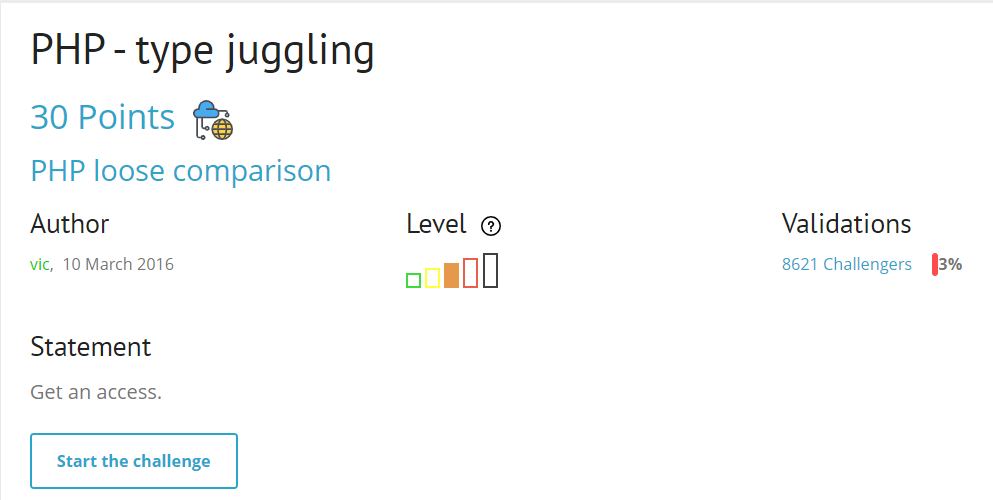
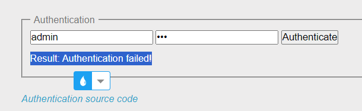
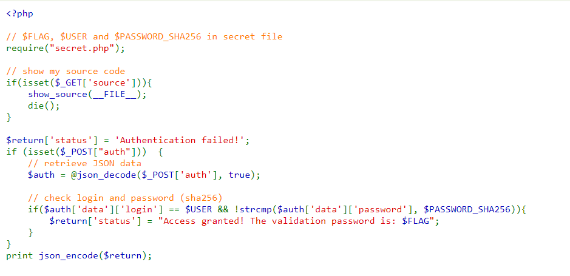
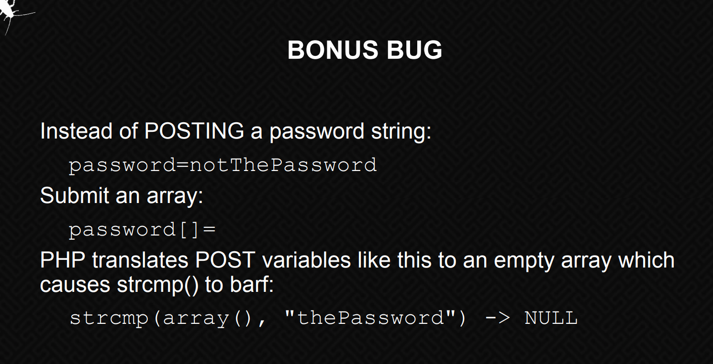
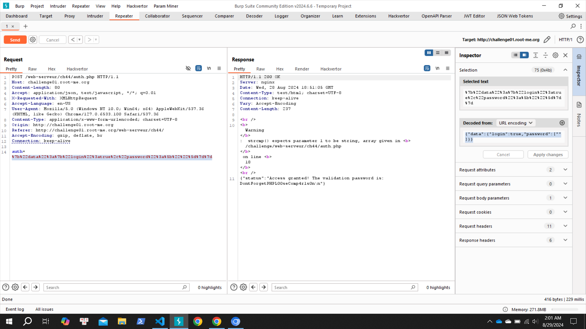

start chall lên nào

feature login

cung cấp source code, đọc nào

mình focus vào so sánh == và strcmp, đây là lỗi ở bài này
giải thích cho ae hiểu và cũng là để bản thân hiểu: điều kiện if trả về true khi == trả về true và strcmp cũng trả về true.
Vậy là mình có thể kiểm soát cái điều kiện so sánh với $USER rồi, chỉ cần `login = true ` là được vì khi string so sánh với true sẽ trả về true, vậy còn strcmp ?

dựa vào tài liệu [này](https://repository.root-me.org/Exploitation%20-%20Web/EN%20-%20PHP%20loose%20comparison%20-%20Type%20Juggling%20-%20OWASP.pdf)

tại đây nếu mình so sánh một `mảng` với 1 chuỗi (password dạng chuỗi string) thì `strcmp nó sẽ trả về null`, khi đó `!strcmp sẽ trả về true`, ok exploit thôi nào

done `soong1002`