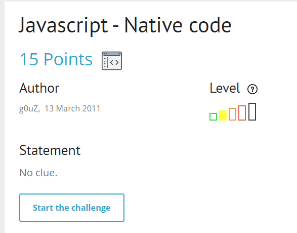
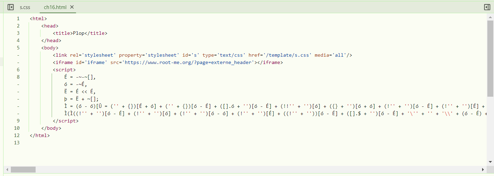
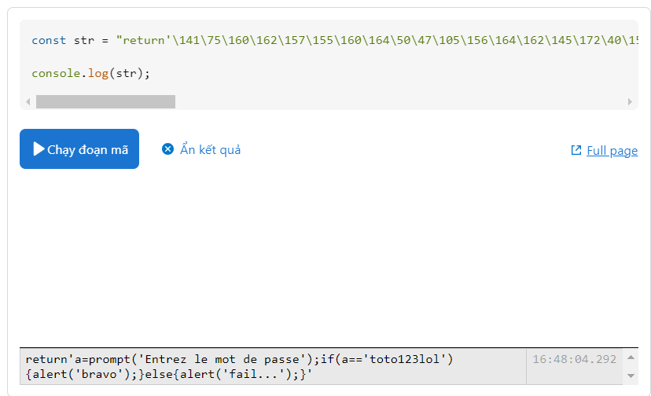

start chall lên

cái gì thế này :)) ?? 

google search mình biết đây là kiểu nén, mình cần giải nén nó ra. tại [đây](https://stackoverflow.com/questions/56205507/is-this-deep-obfuscation-cannot-understand-the-meaning-of-it)

hơi xàm nhỉ @@
