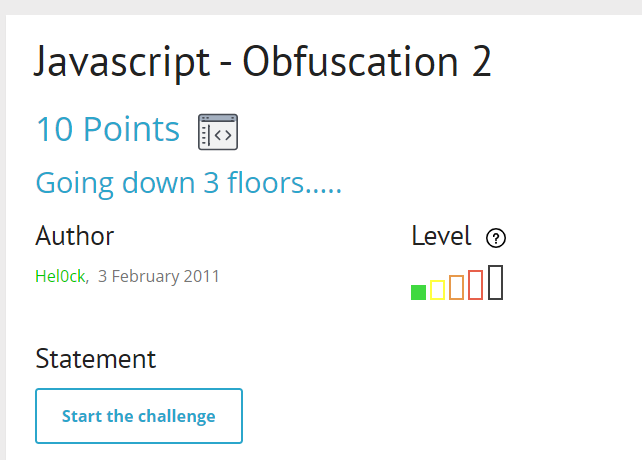
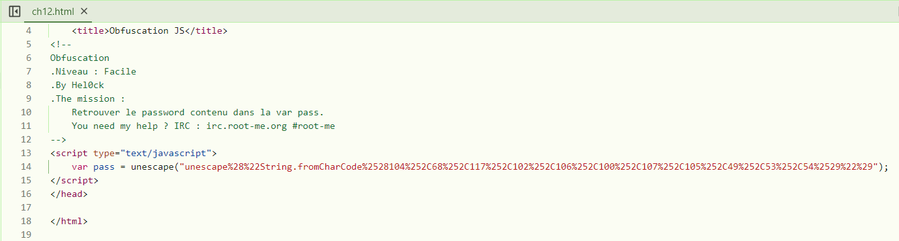
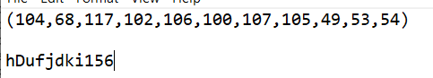

view file html

thấy nó được encode bởi CharCode, mình tiến hành decode 2 lần để thu được các chữ số đại diện cho các chữ cái nhé

decode 2 lần thu được `(104,68,117,102,106,100,107,105,49,53,54)`, check bảng ASCII nào

this is password
