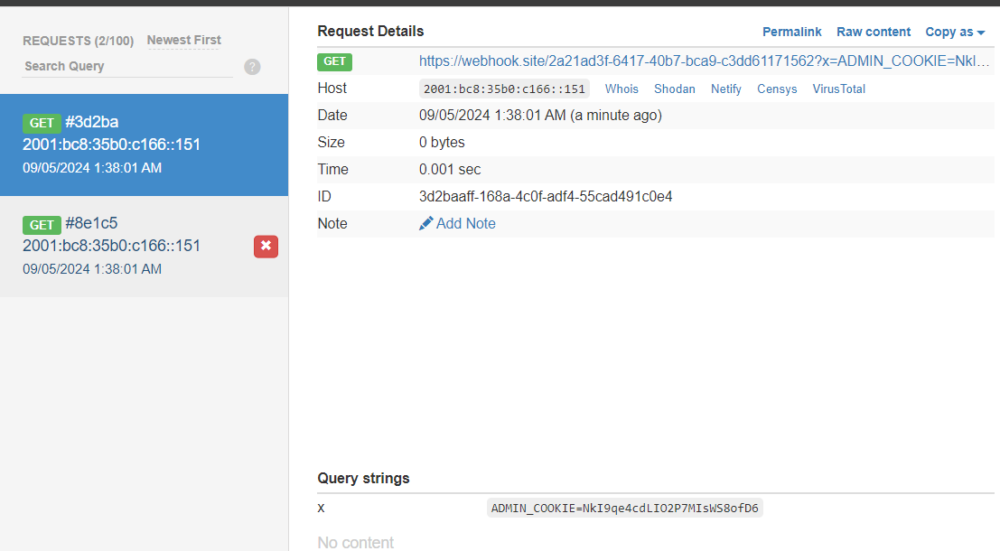

chall cung cấp feature nhập vào message cho admin

vì tiêu đề là XSS Store nên mình tiến hành exploit luôn

khi nhập vào ô message ``

chứng tỏ XSS dính ở message

payload: 
``

chờ admin truy cập, hứng tại webhook

flag: `NkI9qe4cdLIO2P7MIsWS8ofD6`

