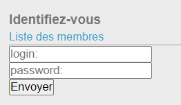
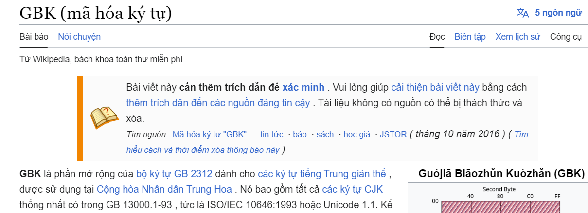
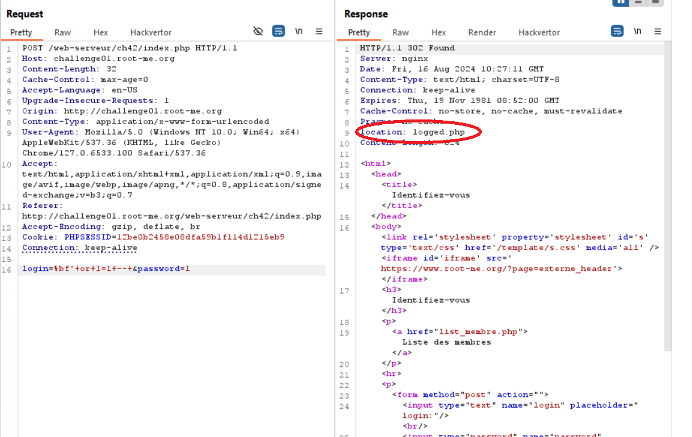
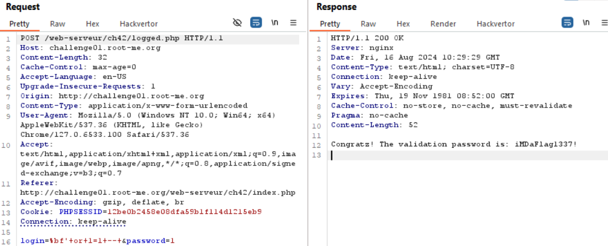

start chall cho 1 form login, trong đó list user chỉ có admin. chúng ta cần login với tư cách là admin

tiến hành thử sai giá trị `admin'` không nhận được lỗi thông báo gì về syntax, có vẻ nó không print err hoặc nó có filter character, dự đoán nó có hàm addslash()để thêm `\` trước các kí tự đặc biệt trong chuỗi

trong des có nói `Do you speak chinese ?` và trong tên chall `GBK` mình tiến hành search google về GBK

mình đặt ra câu hỏi: sẽ ra sao nếu mình lợi dụng chính thằng `addslash()` để bypass ?
như đã biết thì `\` được encode bằng `%5c`, vậy sẽ ra sao nếu mình inject trước nó 1 kí tự để khi + %5c nó sẽ ra kí tự khác, mà ở đây là đề cập đến GBK, tiếng Trung 
Google search mình biết `%af%5c` và `%bf%5c` sau khi decode sẽ trở thành kí tự trung quốc, mình tiến hành exploit

here we go

`soong1002hochack=))`

