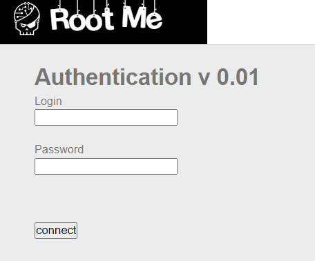
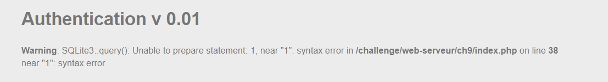
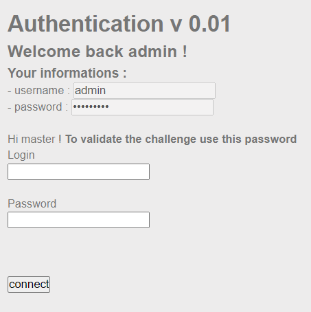
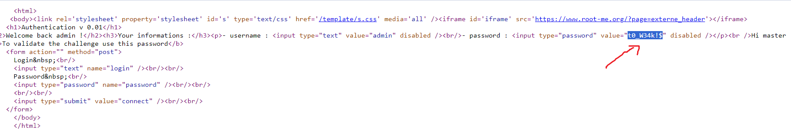

start chall lên mình thấy 1 form login, theo tên của chall mình tiến hành inject cơ bản nhất của lỗi SQL injection: `admin'`

)

báo lỗi systax biết nó sử dụng SQLite để truy vấn, dự đoán nó không filter character
mình truyền payload `admin'--a`

)

view source là có password của admin

)
`soong1002dm`

