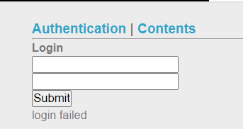
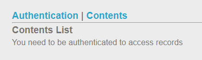
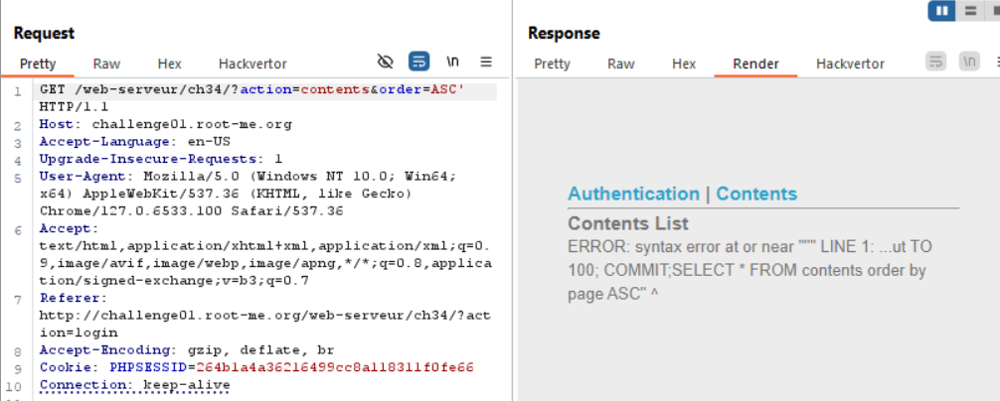
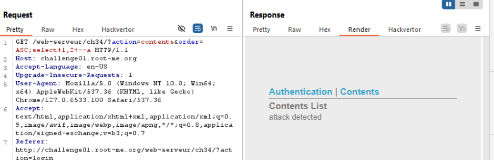
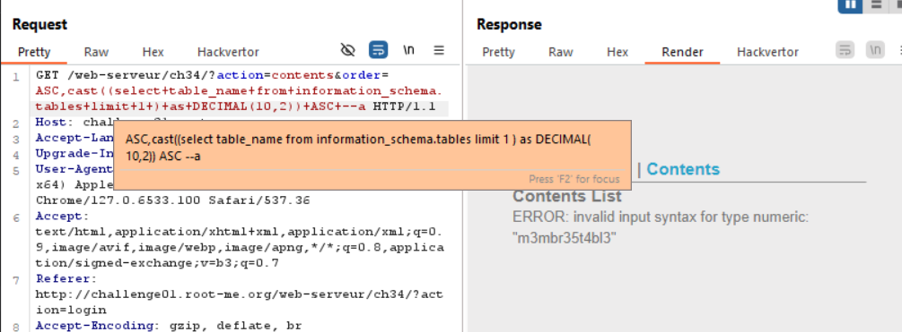
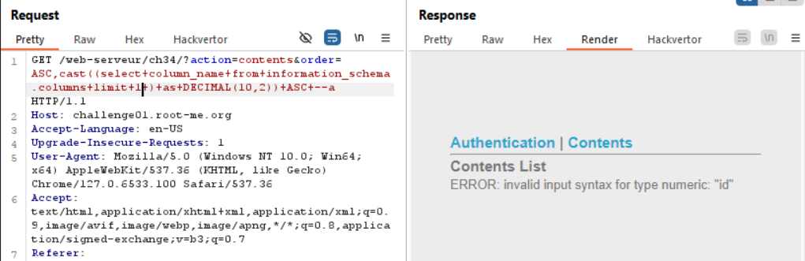
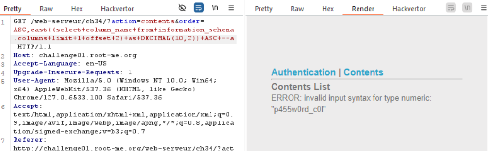
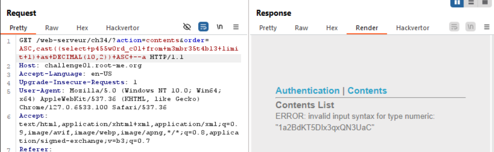

mình thử inject kí tự `'` vào sau username nhưng không thấy báo syntax, có thể là blind sqli, nhưng mình tạm để đó, đi racon thằng Content xem sao nhé

nó báo phải login mới xem được ..

repeater của burp cho mình cái này :v 

mình dự đoán được câu query là `select *from contents order by page ='$_GET['order']'`
nhưng

có vẻ như nó sử lí input là dấu chấm phẩy để ngắt truy vấn rồi, và mình nhìn vào báo lỗi cũng dự đoán được nó đang sử dụng `mysql`

google search cho mình biết `order by` có thể dùng với `cast() ` trong 1 câu truy vấn cho 2 đối tượng khác nhau, lợi dụng điều này mình tiến hành truyền payload
`ASC,cast((select table_name from information_schema.tables) as DECIMAL(10,2)) ASC`

nó nhả lỗi ra chính là tên bảng
tiếp tục lấy tên cột

cột đầu tiên là id, nhưng không phải password, mình phải thêm offset cho nó

GET FLAG

`soong1002`

