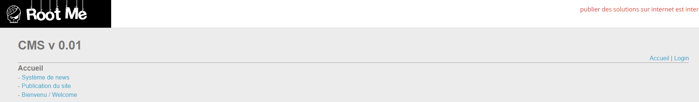
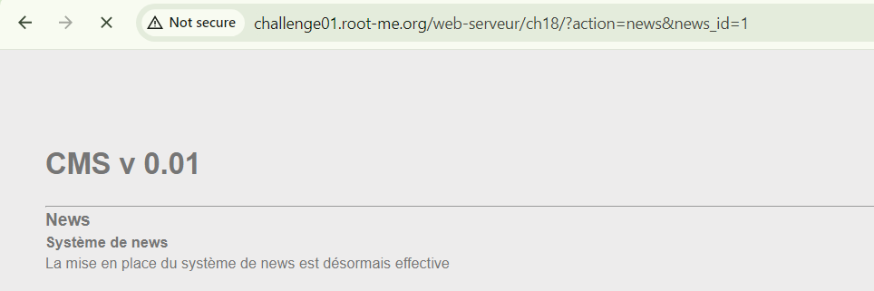
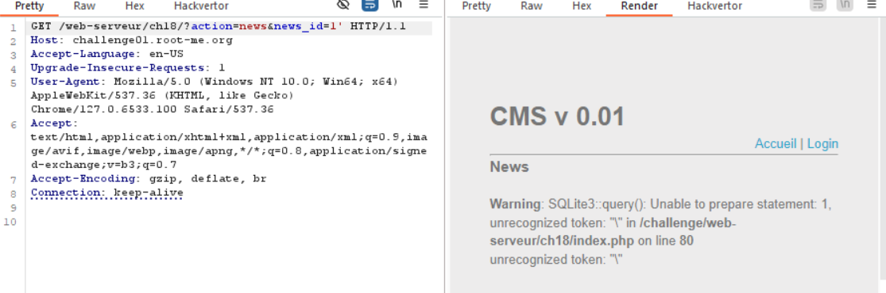
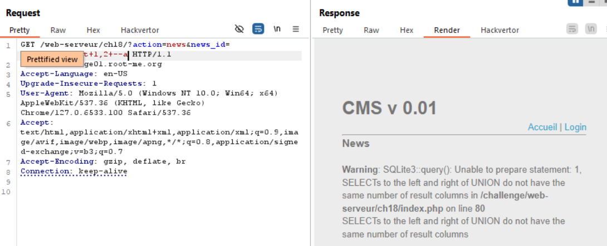
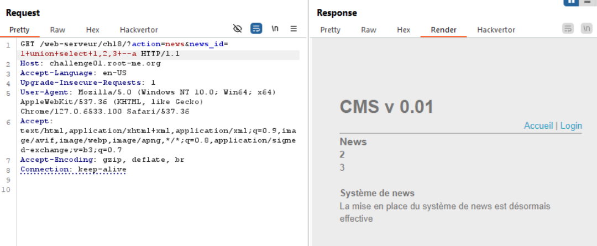
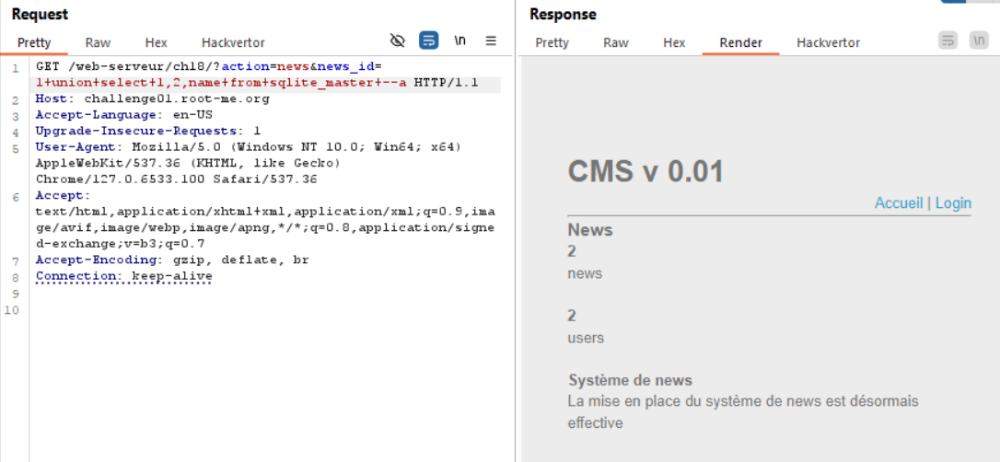
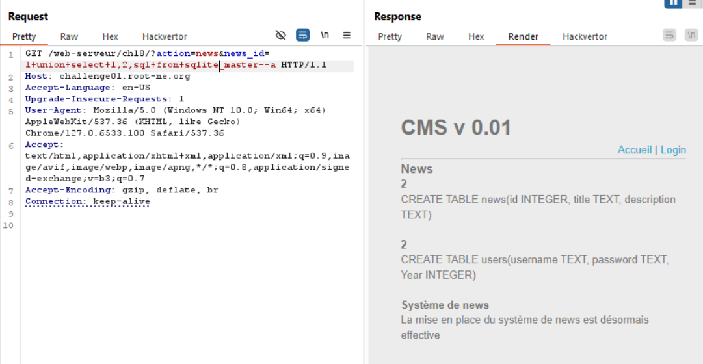
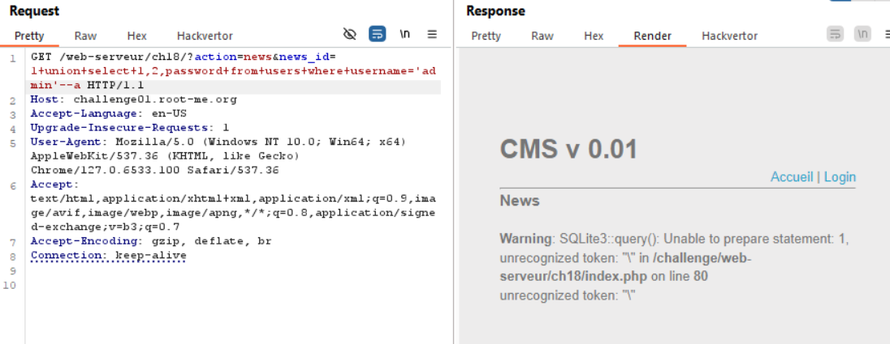
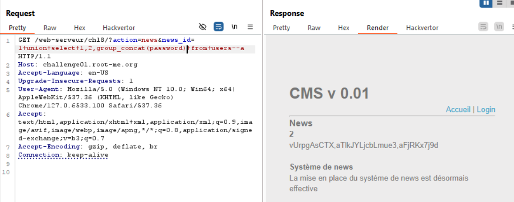
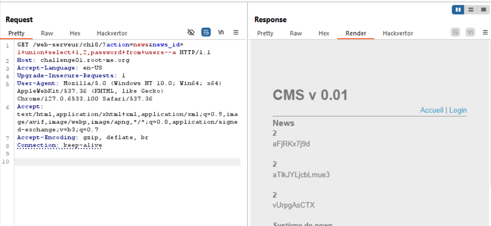

chall cho ta 2 future, mình check qua login với các inject xem nó có báo syntax error không, có vẻ không được, mình focus vào feature còn lại

để ý url mình thấy nó check parameter action và `news_id`
dùng burpsuite chặn bắt nào

đúng như mình dự đoán, dính lỗi ở param news_id
okey, exploit thôi nào

thử sai tiếp tục thay đổi số cột 

-> nó có 3 cột trả về

mình xem được tên bảng là `users`

làm xong mới nhớ mình có thể dùng `sql_master`, cái này để xem lệnh tạo bảng và các cột trong nó =))

get password

quên mất là nó filter dấu nháy `'`
google search mình chơi kiểu `group_concat` để gộp các cột lại thành 1 dòng

Hoặc

`soong1002khocvc`
