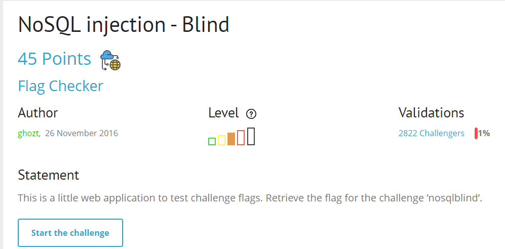
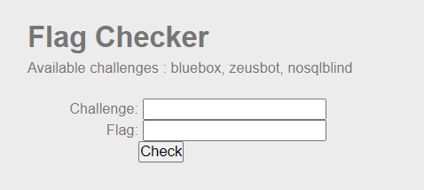
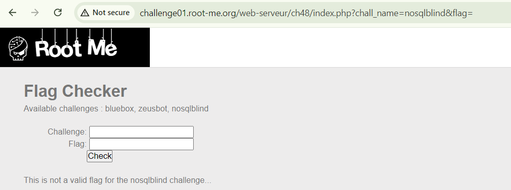
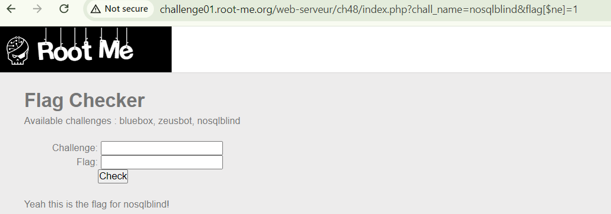
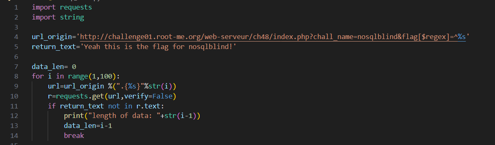
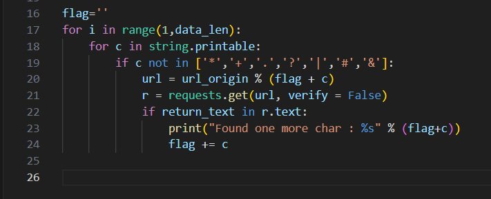

 
 

 
 

Tiến hành nhập value nosqlblind do đề bài bảo lấy flag ở đó

 
Có vẻ như phải nhập chính xác flag mới có thể verify flag, nhưng ta đang đi tìm flag mà =)))
Kinh nghiệm bản than cho cái bài nosql sẽ có thể sử dụng các toán tử :$regex, $ne, $gt, $lt, $gte, $lte, $in, $where,…
ở bài này tôi tiến hành sử dụng $ne để check param chall_name = nosqlblind

http://challenge01.root-me.org/web-serveur/ch48/index.php?chall_name=nosqlblind&flag[$ne]=1

 
Tuyệt vời, verify thành công nhưng méo có flag =))), tôi đã thử check source code xem có bị comment không và kết quả là 0.

Đến đây thì có thể loại bỏ $ne để có thể bypass được rồi, thử toán tử khác thôi. 
Đây là Blind nên có thể dung $regex  để check flag mà.
Syntax $regex = ^.{%s}
trong đó:
 ‘^’ là để so sánh khớp chuỗi bắt đầu từ kí tự đầu tiên
‘.’ Dung để đại diện cho bất kì kí tự nào(trừ newline)
‘{%s}’ chỉ định số lần xuất hiện của bất kì kí tự nào

Từ đó payload ta có :
http://challenge01.root-me.org/web-serveur/ch48/index.php?chall_name=nosqlblind&flag[$regex]=^.{%s}
payload này để check xem flag gồm bao nhiêu kí tự.

 
Payload check số kí tự trong flag ( cái này các bạn tự hiểu nhé =))) )
Nếu đã biết số kí tự trong flag thì giờ khá đơn giản đúng không nào =))). Chỉ cần viết script python lấy flag thôi
<<<<<<< HEAD

 
String.printable chứa tất cả các kí tự có thể in ra được ( các bạn gg them về cái này nhé, nó cũng regex newline và tab đấy ).
Loại bỏ các kí tự ở dòng 19 vì các kí tự này khi nhập trên url sẽ hiểu thành các kí tự phân tách các tham số, làm cho flag vô nghĩa khi request.get 

Them nữa là verify=False để bỏ qua xác thực khi dung requests nhé các men

DONE, chúc ae thành cong =))))

`soong1002nha`

